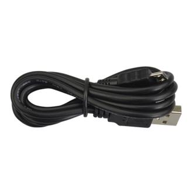
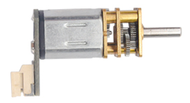
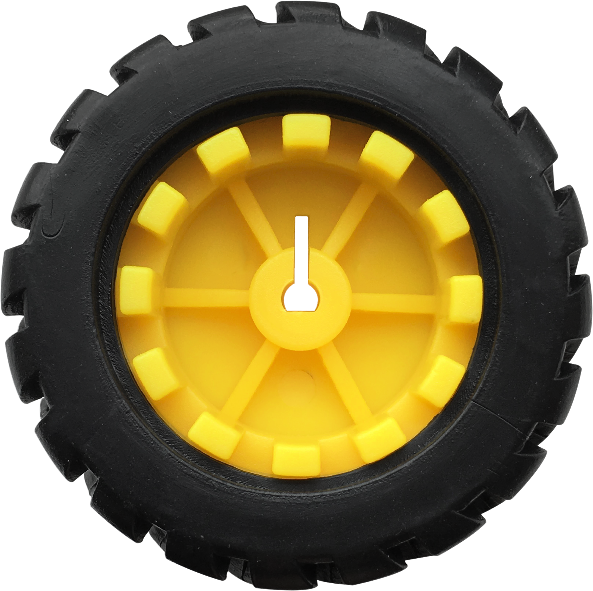
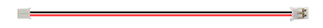
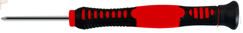
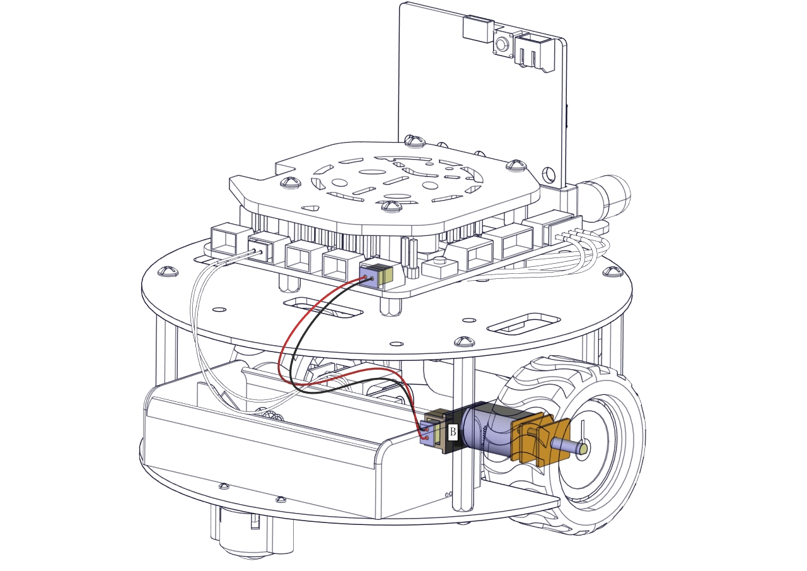
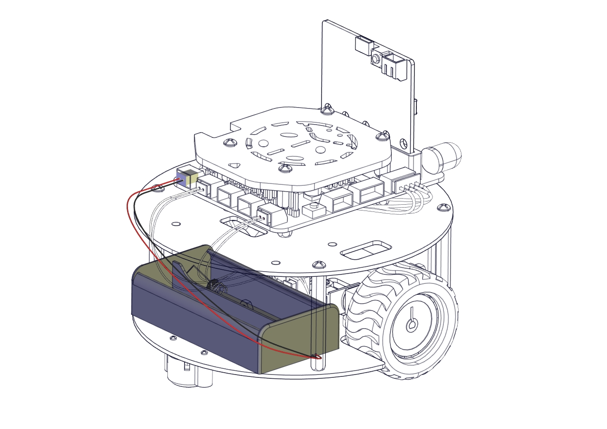

# Getting Started With Micro:bit Turtle Car 

## Description

Micro:bit is significantly applied to STEM education for teenagers, as a small
microcontroller featuring small in size, easy to carry, and powerful functions.
At present, innovative technology products, like robots, wearable devices and
interactive electronic games can be produced by programming and code.

In this kit, we will guide you how to control and generate a Micro:bit turtle
smart car through programming in Makecode.

[MakeCode](https://makecode.com/) is a framework for creating interactive and
engaging programming experiences for those new to the world of programming. The
platform provides the foundation for a tailored coding experience to create and
run user programs on actual hardware or in a simulated target.

What’s more, we also provide test code and projects so as to make smart car
display different effects.

Launched by KEYES group, Keyestudio micro:bit smart car integrates obstacle
avoidance, line tracking and IR and Bluetooth control. It is made up of DC
geared motors, wheels , sensors and acrylic boards. In addition, it is equipped
with a passive buzzer with music play function, 4 pcs WS2812RGB LEDs and 2 pcs
RGB lights.

We believe that your imagination and creativity can be stimulated through
assemble this smart car by yourself and acquire knowledge about how to code
through Makecode, a new method to program.

1.  **Kit List**

| **Components**  |                                                         |         |                                                                                                                                                                                                                                                                                                                                                                                                                                                                                                                                                                                                                                                                                                                                                                                                                                                                                                        |
|-----------------|---------------------------------------------------------|---------|--------------------------------------------------------------------------------------------------------------------------------------------------------------------------------------------------------------------------------------------------------------------------------------------------------------------------------------------------------------------------------------------------------------------------------------------------------------------------------------------------------------------------------------------------------------------------------------------------------------------------------------------------------------------------------------------------------------------------------------------------------------------------------------------------------------------------------------------------------------------------------------------------------|
| **#**          | **Model**                                               | **QTY** | **Picture**                                                                                                                                                                                                                                                                                                                                                                                                                                                                                                                                                                                                                                                                                                                                                                                                                                                                                            |
| 0               | Micro:bit main board **is Not Included** in KS4014 Kit  |         |                                                                                                                                                                                                                                                                                                                                                                                                                                                                                                                                                                                                                                                                                                                                                                                                                                                                                                        |
| 0               | Micro:bit main board is **Included** in KS4024 Kit      | 1       |                                                                                                                                                                                                                                                                                                                                                                                                                                                                                                                                                                                                                                                                                                                                                                                |
| 1               | Keyestudio Micro:bit  Driver Shield                     | 1       |                                                                                                                                                                                                                                                                                                                                                                                                                                                                                                                                                                                                                                                                                                                                                                                                                                              |
| 2               | Keyestudio Quick Connectors  IR Receiver                | 1       |                                                                                                                                                                                                                                                                                                                                                                                                                                                                                                                                                                                                                                                                                                                                                                                                                                                  |
| 3               | Keyestudio Quick Connectors Line Tracking Sensor        | 1       |                                                                                                                                                                                                                                                                                                                                                                                                                                                                                                                                                                                                                                                                                                                                                                                                                                                    |
| 4               | Keyestudio Quick Connectors  Ultrasonic Sensor          | 1       |                                                                                                                                                                                                                                                                                                                                                                                                                                                                                                                                                                                                                                                                                                                                                                                                                                                    |
| 5               | Micro USB Cable AM/MK5P(micro)                          | 1       |                                                                                                                                                                                                                                                                                                                                                                                                                                                                                                                                                                                                                                                                                                                                                                                                                                                       |
| 6               | Keyestudio JMFP-4 17 Key                                | 1       |                                                                                                                                                                                                                                                                                                                                                                                                                                                                                                                                                                                                                                                                                                                                                                                                                                                    |
|                 |                                                         |         |                                                                                                                                                                                                                                                                                                                                                                                                                                                                                                                                                                                                                                                                                                                                                                                                                                                                                                        |
| 1               | Keyestudio Baseplate for Smart Small Turtle Robot V2.0  | 1       |                                                                                                                                                                                                                                                                                                                                                                                                                                                                                                                                                                                                                                                                                                                                                                                                                                                |
| 2               | Keyestudio Round Board                                  | 1       |                                                                                                                                                                                                                                                                                                                                                                                                                                                                                                                                                                                                                                                                                                                                                                                                                                                |
| 3               | Keyestudio Acrylic Top Board                            | 1       |                                                                                                                                                                                                                                                                                                                                                                                                                                                                                                                                                                                                                                                                                                                                                                                                                                                |
| 4               | Micro:bit Fixed Mount                                   | 1       |                                                                                                                                                                                                                                                                                                                                                                                                                                                                                                                                                                                                                                                                                                                                                                                                                                                |
| 5               | Keyestudio Quick Connectors 12FN20 Motor A              | 1       |                                                                                                                                                                                                                                                                                                                                                                                                                                                                                                                                                                                                                                                                                                                                                                                                                                     |
| 6               | Keyestudio Quick Connectors 12FN20 Motor B              | 1       |                                                                                                                                                                                                                                                                                                                                                                                                                                                                                                                                                                                                                                                                                                                                                                                                                                                                                                  |
| 7               | N20 Motor White Mount                                   | 2       |                                                                                                                                                                                                                                                                                                                                                                                                                                                                                                                                                                                                                                                                                                                                                                                                                 |
| 8               | Car Wheels                                              | 2       |                                                                                                                                                                                                                                                                                                                                                                                                                                                                                                                                                                                                                                                                                                                                                                                          |
| 9               | Universal Wheel                                         | 2       |                                                                                                                                                                                                                                                                                                                                                                                                                                                                                                                                                                                                                                                                                                                                                                                                                 |
| 10              | Dual head JST-PH2.0MM-5P Dupont Line                    | 1       |                                                                                                                                                                                                                                                                                                                                                                                                                                                                                                                                                                                                                                                                                                                                                                                                                                                    |
| 11              | Dual head JST-PH2.0MM-4P Dupont Line                    | 1       |                                                                                                                                                                                                                                                                                                                                                                                                                                                                                                                                                                                                                                                                                                                                                                                                                                                 |
| 12              | Dual head JST-PH2.0MM-3P Dupont Line                    | 1       |                                                                                                                                                                                                                                                                                                                                                                                                                                                                                                                                                                                                                                                                                                                                                                                                                                                 |
| 13              | Dual head JST-PH2.0MM-2P Dupont Line                    | 2       |                                                                                                                                                                                                                                                                                                                                                                                                                                                                                                                                                                                                                                                                                                                                                                                                |
| 14              | 18650 2-Slot Battery Holder with 15cm Lead              | 1       |                                                                                                                                                                                                                                                                                                                                                                                                                                                                                                                                                                                                                                                                                                                                                                                                                                                    |
| **Nuts/Screws** |                                                         |         |                                                                                                                                                                                                                                                                                                                                                                                                                                                                                                                                                                                                                                                                                                                                                                                                                                                                                                        |
| 1               | M2\*12MM Round Head Screws                              | 6       |                                                                                                                                                                                                                                                                                                                                                                                                                                                                                                                                                                                                                                                                                                                          |
| 2               | M2 Nickel Plated Nuts                                   | 6       |                                                                                                                                                                                                                                                                                                                                                                                                                                                                                                                                                                                |
| 3               | M3\*6MM Round  Head Screws                              | 20      |  |
| 4               | M3\*8MM Round  Head Screws                              | 8       |                                                                                                                                                                                                                                                                                                                                                                                                                                                                                                                                            |
| 5               | M3\*10MM Flat  Head Screws                              | 4       |                                                                                                                                                                                                                                                                                                                                                                                                                                                                                                                                                                                                                                                                                                                          |
| 6               | M3 Nickel Plated Nuts                                   | 12      |                                                                                                                                                                                                                                                        |
| 7               | M3\*15+6MM Hex Copper Bush                              | 4       |                                                                                                                                                                                                                                                                                                                                                                                                                                                                                                                                                                                                                                                                                                         |
| 8               | Dual-pass M3\*12MM  Hex Copper Bush                     | 4       |                                                                                                                                                                                                                                                                                                                                                                                                                                                                                                                                                                                                                                                                                                                                                                                                                 |
| 9               | Dual-pass M3\*40MM Hex Copper Bush                      | 4       |                                                                                                                                                                                                                                                                                                                                                                                                                                                                                                                                                                                                                                                                                                                                                                                                                 |
| **Tools**       |                                                         |         |                                                                                                                                                                                                                                                                                                                                                                                                                                                                                                                                                                                                                                                                                                                                                                                                                                                                                                        |
| 1               | 3\*40MM Screwdriver                                     | 1       |                                                                                                                                                                                                                                                                                                                                                                                                                                                                                                                                                                                                                                                                                                                                                                                                                                                        |
| 2               | Map                                                     | 1       |                                                                                                                                                                                                                                                                                                                                                                                                                                                                                                                                                                                                                                                                                                                                                                                                                                                         |
| 3               | Black Ties 3\*100MM                                     | 5       |                                                                                                                                                                                                                                                                                                                                                                                                                                                                                                                                                                                                                                                                                                                                                                                                                                                         |
| 4               | 18650 Battery （not included）                          | 2       |                                                                                                                                                                                                                                                                                                                                                                                                                                                                                                                                                                                                                                                                                                                                                                                                                                                    |

## Specifications

-   Connector port input: DC 6V---9V

-   Operating voltage of drive board system: 5V

-   Standard operating power consumption: about 2.2W

-   Maximum power: Maximum output power is 12W

-   Motor speed: 100RPM/1min

-   Working temperature range: 0-50℃

-   Size: 120\*120\*120mm

-   Environmental protection attributes: ROHS

Note: working voltage of micro:bit is 3.3V, driver shield integrates 3.3V/5V
communication conversion circuit.

## Introduction

**1 What is Micro:bit?**

Designed by BBC, Micro:bit main board aims to help children aged above 10 years
old to have a better learning of programming.

It is equipped with loads of components,including a 5\*5 LED dot matrix, 2
programmable buttons, a compass, a Micro USB interface and a Bluetooth module
and others. Though it is just the size of a credit card, it boasts multiple
functions. To name just a few, it can be applied in programming video games,
making interactions between light and sound, controlling a robot, conducting
scientific experiments, developing wearable devices and make some cool
inventions like robots and musical instruments, basically everything imaginable.

This new version, that’s the version 2.0, of Micro:bit main board has a
touch-sensitive logo and a MEMS microphone. And there is a buzzer built in the
other side of the board which makes playing all kinds of sound possible without
any external equipment. The golden fingers and gears added provide a better
fixing of crocodile clips. Moreover, this board has a sleeping mode to lower the
power consumption of battery and it can be entered if users long press the Reset
& Power button on the back of it. More importantly, the CPU capacity of this
version is much better than that of the V1.5 and the V2 has more RMA.

In final analysis, the V2 Micro:bit main board can allow customers to explore
more functions so as to make more innovative products.

**2 Comparison between V2.0 & V1.5**

**Micro:bit main board V2.0**

**Micro:bit main board V1.5**

**More details:**

For the Micro: Bit main board V2, pressing the Reset & Power button , it will
reset the Micro: Bit and rerun the program.If you hold it tight, the red LED
will slowly get darker.When the power indicator becomes darker, releasing the
button and your Micro: Bit board will enter sleep mode for power saving .This
will make your battery more durable. And you could press this button again to
‘wake up’ your Micro:bit.

For more information,please resort to following links：

<https://tech.microbit.org/hardware/>

https://microbit.org/new-microbit/

https://www.microbit.org/get-started/user-guide/overview/

<https://microbit.org/get-started/user-guide/features-in-depth/>

**3 Pinout**

Micro:bit main board V2.0 VS V1.5

Browse the official website for more details:

<https://tech.microbit.org/hardware/edgeconnector/>

<https://microbit.org/guide/hardware/pins/>

**4 Notes for the application of Micro:bit main board V2.0**

1.  it is recommended to cover it with a silicone protector to prevent short
    circuit for it has a lot of sophisticated electronic components.

2.  its IO port is very weak in driving since it can merely handle current less
    than 300mA. Therefore, do not connect it with devices operating in large
    current,such as servo MG995 and DC motor or it will get burnt. Furthermore,
    you must figure out the current requirements of the devices before you use
    them and it is generally recommended to use the board together with a
    Micro:bit shield.

3.  It is recommended to power the main board via the USB interface or via the
    battery of 3V. The IO port of this board is 3V, so it does not support
    sensors of 5V. If you need to connect sensors of 5 V, a Micro: Bit expansion
    board is required.

d.When using pins(P3, P4, P6, P7, P10)shared with the LED dot matrix, blocking
them from the matrix or the LEDs may display randomly and the

data about sensors maybe wrong.

e.The battery port of 3V cannot be connected with battery more than 3.3V or the
main board will be damaged.

f. Forbid to use it on metal products to avoid short circuit.

-   

To put it simple, Micro:bit V2 main board is like a micro computer which has
made programming at our fingertips and enhanced digital innovation. And about
programming environment, BBC provides a website: <https://microbit.org/code/,>
which has a graphical MakeCode program easy for use.

## Install Micro:bit Driver

If you have downloaded micro:bit driver, then no need to download it again.

If it is you first time to use micro:bit main board, then you will have to
download the driver.

You have to install the driver of micro:bit if it’s your first time to use
micro:bit.

You could enter the link: https://fs.keyestudio.com/KS4014Driver to download
driver file .

## Assemble Turtle Car

Connection of Micro:bit and Turtle Smart Car

| Pins of Micro:bit  | Components of Keyestudio  micro:bit Robot Car    |
|--------------------|--------------------------------------------------|
| P0                 | Passive Buzzer                                   |
| P1                 | Trig（T） of ultrasonic sensor                    |
| P2                 | Echo（E）of ultrasonic sensor                    |
| P8                 | 4 pcs WS2812RGB                                  |
| P11                | IR Receiver                                      |
| P14                | Left TCRT5000 IR tubes of line tracking sensor   |
| P15                | Middle TCRT5000 IR tubes of line tracking sensor |
| P16                | Right TCRT5000 IR tubes of line tracking sensor  |

**Power Supply**

This smart car is powered by 2pcs 18650 batteries. And the battery holder is
chargeable.

Note: battery is not included.

**1. Install Micro:bit Mini Turtle Smart Car**

 Install baseplate and line tracking sensor

Note: we screw out the two self-locking screws first, and install universal
wheel on V2.0 baseplate with these screws(don’t screw them too tightly)

Make the side printed“Keyes”downward.

 Mount Motor and Battery Holder

  Assemble Car Wheels and Dual-pass Hex Copper Bushes

 Install Ultrasonic Sensor

  Mount the Middle Board and IR Receiver

Note: make the side printed“Keyes”upward when installing the middle board.

  Install micro:bit TB6612 Motor Driver Shield

  Install Top Board

  Install Micro:bit Board

**2.Wiring Up**

We need an additional 3P wire to connect IR receiver.

Black line is connected to G（-）, red wire is connected to 5V（+）

|                | Battery Holder | Motor  A(Left) | Motor  B(Right)  | Line Tracking  Sensor |  IR Receiver | Ultrasonic  Module |
|----------------|----------------|----------------|------------------|-----------------------|--------------|--------------------|
| Driver  Shield | 7-12V IN (+ -) |  A1            |  B1              |  P16 P15 P14 5V G     |  P11 5V G    |  P2 P1 5V G        |

Wire up ultrasonic sensor, motors, IR receiver, line tracking sensor and battery
holder

## Resources

[https://fs.keyestudio.com/KS4014](https://fs.keyestudio.com/KS4014)

Wiki page: <https://wiki.keyestudio.com/Main_Page>

Official website: <https://keyestudio.com/>
