#  MakeCode Tutorial

## How to Code and Programming

We take Windows system as example to show you.

Get started with Micro:bit: <Https://microbit.org/guide/quick/>

Step 1: Connect Micro：bit Board

Link micro:bit board to computer with USB cable.（Guide to mobile
apps：https://microbit.org/get-started/user-guide/mobile/）

Macs ,PCs, Chromebooks and Linux system（including Raspberry Pi）support
micro：bit.

The board is powered when the LED on the back of the board turns red.

There will be a MICROBIT driver in your computer, as shown below:

Step 2: Programming

View the link https://makecode.microbit.org/ in your browser;

Click ‘New Project’;

The dialog box‘Create a Project’ appears, fill it with ‘heartbeat’ and click
‘Create √’to edit.

(If you are running Windows 10 system, it is also viable to edit on the APP
MakeCode for micro:bit , which is exactly like editing in the website. And the
link to the APP is
https://www.microsoft.com/zh-cn/p/makecode-for-micro-bit/9pjc7sv48lcx?ocid=badgep&rtc=1&activetab=pivot:overviewtab
)

Write a set of micro:bit code. You can drag some modules in the Blocks to the
editing area and then run your program in Simulator of MakeCode editor as shown
in the picture below.There is a video to show you how to
finish“heartbeat”pattern.

Link for the video
[microbit-heartbeat.mp4](Makecode%20Code/8.1：Heartbeat/microbit-heartbeat.mp4.mp4)

Next, we will introduce Makecode.

Click”JS JavaScript”, you will find the corresponding programming languages.

Click the little triangle”of JS JavaScript”to choose “Python”, you will find the
corresponding Python programming languages.

Step 3: Download Code

If your computer is Windows 10 and you have downloaded the APP MakeCode for
micro:bit to write program, what you will have to do to download the program to
your Micro: Bit main board V2 is merely clicking the ‘Download’ button, then all
is done.

If you are writing programs through the website, following these steps:

Click the ‘Download’ in the editor to download a "hex" file, which is a compact
program format that the Micro: Bit main board can read.Once the hexadecimal file
is downloaded, copy it to your board V2 just like the process that you copy the
file to the USB drive. If you are running Windows system, you can also
right-click and select ‘Send to → Microbit (E) ‘to copy the hex file to the
Micro: Bit main board V2

You can also directly drag the "hex" file onto the MICROBIT (E) disk.

During the process of copying the downloaded hex file to the Micro: Bit main
board V2, the yellow signal light on the back side of the board flashes. When
the copy is completed, the yellow signal light will stop flashing and remain on.

Step 4: Run program

Upload code on micro:bit board and plug in power with USB cable.

LED dot matrix will display heartbeat pattern.

Power via micro USB & via external power supply

Programming each time, MICROBIT drive will automatically eject and return.
Micro:bit only receives hex files rather than save any file.

This chapter only shows you how to get started with micro:bit board. Python and
JavaScript also support micro:bit board with the exception of Makecode.

<https://microbit.org/code/>

<https://microbit.org/projects/>

### 7.1 Makecode

Browse <https://makecode.microbit.org/> and enter Makecode online editor.

Click“New Project”, and input“heartbeat”，then enter Makecode editor, as shown
below:

There are blocks“on start”and“forever”in the code editing area.

After power on or reset, “on start”means that the code in the block executes
once while“forever”implies that the code runs cyclically.

### 7.2 Quick Download

As mentioned before, if your computer is Windows 10 and you have downloaded the
APP MakeCode for micro:bit to write programs, the program written can be quickly
downloaded to the Micro: Bit main board V2 by selecting ‘Download’.

While it is a little more trickier if you are using a browser to enter makecode.
However, if you use Google Chrome, suitable for Linux，macOS and Windows 10, the
process can be quicker too.

We use the webUSB function of Chrome to allow the internet page to access the
hardware device connected USB.

You could refer to the following steps to connect and pair devices.

Device pairing

Interface micro:bit with computer using USB cable.

Click“...”beside“Download”and tap“Pair device”.

Continue to tap“Pair device”

Then select the device you want to connect and tap“connect”in the window popping
up.

If there is no device in the window, please refer to the following link:

[https://makecode.microbit.org/device/usb/webusb/troubleshoot](https://makecode.microbit.org/device/usb/webusb/troubleshoot%20)

We also provide in the resource
link <https://fs.keyestudio.com/KS4014>

What’s more, if you don’t know how to update the firmware of micro:bit, refer to
the link:
[https://microbit.org/guide/firmware/](https://microbit.org/guide/firmware/%20)
or browse folderwe provide.

After connecting successfully, press buttons and download code to micro:bit.

### 7.3 How to Import Extension Library on Makecode

Next, we need to import turtle-bit extension library for further lessons.

Add a Kit-bit extension library

Enter Makecode editor and click
icon and tap

Copy
[https://github.com/mworkfun/pxt-turtle-bit.git](https://github.com/mworkfun/pxt-k-bit.git)
in the searching box and search turtle-bit extension library.

After the installation,“turtle-bit”extension library will appear in the page

**Note: the extension library added is only valid to one project. Therefore, it
won’t appear in other projects.**

**You need to add the turtle-bit extension library again when creating new
projects.**

Update or Delete Turtle-bit Extension Library

Refer to the following instruction please, if you intend to update or delete
turtle-bit extension library.

Click "Js JavaScript" button to switch into text code

Click“Explorer”to get extension library .

Click“”to delete turtle-bit
extension program(TurtleBit IrRemote and Neopixel), next to
tap“”to update turtle-bit
extension program.

### 7.4 Resources and Code

Download resources and code of tool package: <https://fs.keyestudio.com/KS4014>
.

After the tool package is downloaded and unzipped, a file named KS4014 Micro Bit
Mini Smart Turtle Car will be generated. It can be placed everywhere.

### 7.5 Import Code

We provide every program with hex file. You could import it directly or program
in Makecode blocks area, therefore, the extension library must be added.[(How to
add extension?)](##M11)

Next, we will take“heartbeat”as example to introduce how to import code

Open Makecode online editor on your computer

Click“Import”and“Import files”

Choose file“../Test Code/7.1：heartbeat/microbit-heartbeat.hex”, then tap“Go
ahead”

In addition to the above method of importing code , you can also directly drag
cod into the Makecode compiler, as shown in the figure below:

The program is imported successfully after seconds

### 7.6 Install CoolTerm

If your computer system is Windows7/8 rather than Windows 10, the device can’t
be paired in Google Chrome, as a result, the digital/analog signals can’t be
read.

Here, we need CoolTerm software to read data.

For the whole projects, we will use CoolTerm software.

Let’s install it firstly.

CoolTerm program is used to read the serial communication.

Download CoolTerm program:

<https://freeware.the-meiers.org/>

1.  After the download, we need to install CoolTerm program file, the Window
    system is taken as an example.

2.  Choose“win”

3.  Unzip file and open it. (also suitable for Mac and Linux system)

1.  Double-click 

Note: you have to install the driver of micro:bit and connect micro:bit to
computer

The functions of each button on the toolbar are listed below:
<http://wiki.keyestudio.com/index.php/File:IDE.png>

|         | Opens up a new Terminal                           |
|--------------------------------------------------------|---------------------------------------------------|
|         | Opens a saved Connection                          |
|         |  Saves the current Connection to disk             |
|  | Opens the Serial Connection                       |
|  | Closes the Serial Connection                      |
|  | Clears the Received Data                          |
|  | Opens the Connection Options Dialog               |
|  | Displays the Terminal Data in Hexadecimal Format  |
|         | Displays the Help Window                          |

## Projects

(Note: project 1 to 12 will be conducted with the built-in sensors and LED dot
matrix of the Micro:bit main board V2)

### 1：Heartbeat

1.  **Description：**

Prepare a Micro:bit board and USB cable. Next we will conduct a basic experiment
that a heartbeat pattern flashes on micro:bit board.

1.  **Experimental Preparation：**

2.  Connect micro:bit to computer with USB cable

3.  Open online Makecode editor

**Import Hex profile** [**(How to import?)** ](##_7.6.导入代码)

**Or click“New Project”and drag blocks step by step**

1.  **Test Code：**

| Type     | Route                                          | File Name               |
|----------|------------------------------------------------|-------------------------|
| Hex file | ../Makecode Tutorial/Test Code/8.1：Heart beat | microbit-Heart beat.hex |

Or you could edit code step by step in the editing area.

1.  Go to“Basic”→“show icon”.

Copy it again and place into“forever”block.

Click“❤”to select“”.

Complete Program：

| ”    |
|--------------------------------------------------------------------------------------------------------------------------------------------------------------------------------------------------------------------------------------------------------------------------------------------------------------------|
|                                                                                                                                                                                                                                                                                                                    |

Click“JavaScript" to view the corresponding JavaScript code:

**4. Test Results:**

Download code to micro:bit and keep USB cable connected. The LED dot matrix will
display  and
 ceaselessly

([How to download?](##A01) [How to quick download?](##_7.3.快速下载))

If download unsuccessfully, disconnect micro:bit and reboot it

### 2：Light Up A Single LED

1.  **Description：**

Micro:bit motherboard consists of 25 light-emitting diodes, 5 pcs in a group.
They correspond to x and y axis. Then the 5\*5 matrix is formed. Moreover, every
diode locates at the point of x and y axis.

Virtually, we could control an LED by setting coordinate points. For instance,
set coordinate point（0，0）to turn on the LED at row 1 and column 1; light up
LED at the row 1 and column 3, we could set （2，0) and so on.

1.  **Experimental Preparation：**

(1) Connect micro:bit to computer with USB cable.

(2) Open online Makecode editor.

**Import Hex profile** [**(How to import?)** ](##_7.6.导入代码)

**Or click “New Project”and drag blocks step by step**

**3. Test Code：**

Import hex file:

| Type     | Route                                                    | File Name                          |
|----------|----------------------------------------------------------|------------------------------------|
| Hex file | ../Makecode Tutorial/Test Code/8.2 Light Up A Single LED | microbit-Light Up A Single LED.hex |

Or you could edit code step by step in the editing area.

1.  A. Click“Led”→“more”→“led enable false”

B. Put it into the“on start”block, and click the drop-down triangle button to
select“true”.

\*\*\*\*\*\*\*\*\*\*\*\*\*\*\*\*\*\*\*\*\*\*\*\*\*\*\*\*\*\*\*\*\*\*\*\*\*\*\*\*\*\*\*\*\*\*\*\*\*\*\*\*\*\*\*\*\*\*\*\*\*\*\*\*\*\*\*\*\*\*\*\*\*\*\*\*\*
(2) A. Enter“Led”→“toggle x 0 y 0”block;

B. Combine it with“forever”，alter“x 0”into“x 1”.

\*\*\*\*\*\*\*\*\*\*\*\*\*\*\*\*\*\*\*\*\*\*\*\*\*\*\*\*\*\*\*\*\*\*\*\*\*\*\*\*\*\*\*\*\*\*\*\*\*\*\*\*\*\*\*\*\*\*\*\*\*\*\*\*\*\*\*\*\*\*\*\*\*\*\*\*\*

(3) A. Enter“Basic”→“pause (ms) 100”from“

B. Then move it below the“toggle x1 y0”block, and set to
500ms.

(4) Duplicate code stringonce and
place it into“forever”block.

\*\*\*\*\*\*\*\*\*\*\*\*\*\*\*\*\*\*\*\*\*\*\*\*\*\*\*\*\*\*\*\*\*\*\*\*\*\*\*\*\*\*\*\*\*\*\*\*\*\*\*\*\*\*\*\*\*\*\*\*\*\*\*\*\*\*\*\*\*\*\*\*\*\*\*\*\*

1.  A. Enter“Led”→“plot x 0 y 0”

B. Keep it beneath block“pause(ms)500”, then set to“plot x 3 y
4”.

\*\*\*\*\*\*\*\*\*\*\*\*\*\*\*\*\*\*\*\*\*\*\*\*\*\*\*\*\*\*\*\*\*\*\*\*\*\*\*\*\*\*\*\*\*\*\*\*\*\*\*\*\*\*\*\*\*\*\*\*\*\*\*\*\*\*\*\*\*\*\*\*\*\*\*\*\*

1.  Replicate“pause (ms) 500”once and keep it below the block“plot x3y4”

1.  

2.  Click“Led”→“unplot x 0 y 0”and set to“unplot x3 y 4”;

3.  Lay down it beneath“pause (ms) 500”block

4.  Copy“pause (ms) 500”block once, and keep it below the“unplot x3 y
    4”block.

Complete Program：

| 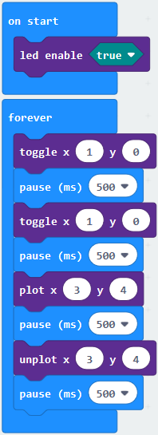 |
|-------------------------------------------------|
|                                                 |

Click“JavaScript”to switch into corresponding JavaScript code:

**4. Test Results：**

Upload program and plug in micro:bit via USB port, the LED at coordinate point
(1,0) flashes for 0.5s, then the LED at (3,4）blinks for 0.5s, alternately.

([How to download?](##A01) [How to quick download?](##_7.3.快速下载))

### 3：5 x 5 LED Dot Matrix

1.  **Description：**

Dot matrices are very commonplace in daily life. They have found wide
applications in LED advertisement screens, elevator floor display, bus stop
announcement and so on.

The LED dot matrix of Micro: Bit main board V2 contains 25 LEDs in a grid.
Previously, we have succeeded in controlling a certain LED to light by
integrating its position value into the test code. Supported by the same theory,
we can turn on many LEDs at the same time to showcase patterns, digits and
characters.

What’s more, we can also click”show icon“ to choose the pattern we like to
display. Last but not the least, we can our design patterns by ourselves.

1.  **Experimental Preparation：**

2.  Connect micro:bit to computer with USB cable

3.  Open online Makecode editor

**Import Hex profile** [**(How to import?)** ](##_7.6.导入代码)**, or click“New
Project”and drag blocks step by step.**

1.  **Test Code：**

**Code 1：**

| Type     | Route                                                           | File Name           |
|----------|-----------------------------------------------------------------|---------------------|
| Hex file | ../Makecode Tutorial/Test Code/8.3：5 x 5 LED Dot Matrix/Code-1 | microbit-Code-1.hex |

Or you could edit code step by step in the editing area.

1.  A. Enter“Led”→“more”→“led enable false”

2.  Click the drop-down triangle button to select“true”
    

3.  Combine it with“on start”block

\*\*\*\*\*\*\*\*\*\*\*\*\*\*\*\*\*\*\*\*\*\*\*\*\*\*\*\*\*\*\*\*\*\*\*\*\*\*\*\*\*\*\*\*\*\*\*\*\*\*\*\*\*\*\*\*\*\*\*\*\*\*\*\*\*\*\*\*\*\*\*\*

1.  Click“Led”to move“plot x 0 y 0”into“forever”, then replicate“plot x 0 y
    0”for 8 times, respectively set to“x 2”y 0”,“x 2”y 1”,“x 2”y 2”,“x 2”y 3”,“x
    2”y 4”,“x 1”y 3”“x 0”y 2”,“x 3”y 3”,“x 4”y 2”.

Complete Program：

|  |
|-------------------------------------------------|
|                                                 |

Click“JavaScript" to switch into the corresponding JavaScript code:
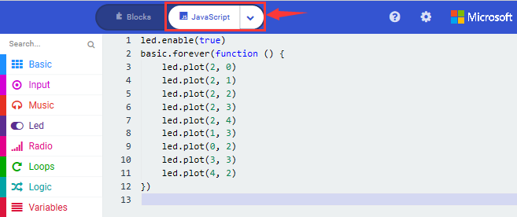

**Code 2：**

| Type     | Route                                                           | File Name           |
|----------|-----------------------------------------------------------------|---------------------|
| Hex file | ../Makecode Tutorial/Test Code/8.3: 5 x 5 LED Dot Matrix/Code-2 | microbit-Code-2.hex |

Or you could edit code step by step in the editing area.

1.  A. Enter“Basic”→“show number 0”block,

2.  Duplicate it for 4 times, then separately set to“show number 1”,“show number
    2”,“show number 3”,“show number 4”,“show number 5”.

\*\*\*\*\*\*\*\*\*\*\*\*\*\*\*\*\*\*\*\*\*\*\*\*\*\*\*\*\*\*\*\*\*\*\*\*\*\*\*\*\*\*\*\*\*\*\*\*\*\*\*\*\*\*\*\*\*\*\*\*\*\*\*\*\*\*\*\*\*\*\*\*\*\*\*\*\*\*

1.  Click“Basic”→“show leds”, then put it into“forever”block，tick blue boxes to
    light LED and generate“↓”pattern.

    

\*\*\*\*\*\*\*\*\*\*\*\*\*\*\*\*\*\*\*\*\*\*\*\*\*\*\*\*\*\*\*\*\*\*\*\*\*\*\*\*\*\*\*\*\*\*\*\*\*\*\*\*\*\*\*\*\*\*\*\*\*\*\*\*\*\*\*\*\*\*\*\*\*\*\*\*\*\*

1.  Move out the block“show string”from“Basic”block, and leave it beneath
    the“show leds”block

    

Choose“show icon”from“Basic”block, and leave it beneath the block“show
string“Hello!”block

\*\*\*\*\*\*\*\*\*\*\*\*\*\*\*\*\*\*\*\*\*\*\*\*\*\*\*\*\*\*\*\*\*\*\*\*\*\*\*\*\*\*\*\*\*\*\*\*\*\*\*\*\*\*\*\*\*\*\*\*\*\*\*\*\*

1.  A. Enter“Basic”→“show arrow North”;

B. Leave it into“forever”block，replicate“show arrow North”for 3
times，respectively set to“North East”, “South East”, “South West”,“North West”.

1.  Click“Basic”to get block“clear screen”then remain it below the block “show
    arrow North West”

\*\*\*\*\*\*\*\*\*\*\*\*\*\*\*\*\*\*\*\*\*\*\*\*\*\*\*\*\*\*\*\*\*\*\*\*\*\*\*\*\*\*\*\*\*\*\*\*\*\*\*\*\*\*\*\*\*\*\*\*\*\*\*\*\*

1.  Drag“pause (ms) 100”block from“Basic”block and set to 500ms, then leave it
    below“clear screen”block.

Complete Program:

|   |
|--------------------------------------------------|
|                                                  |

Click“JavaScript" to check the corresponding JavaScript code:

1.  **Test Results：**

Upload code 1 and plug in micro:bit via USB cable , we will see the icon
.

Upload code 2 and plug in micro:bit via USB cable. Micro: bit starts showing
number 1, 2, 3, 4, and 5, then cyclically displays patterns
,“Hello!”,
,
,
,
 and
.

([How to download?](##A01) [How to quick download?](##_7.3.快速下载))

### 4：Programmable Buttons

1.  **Description：**

The button can control the on and off of the circuit. The button is attached to
the circuit. The circuit is disconnected when the button is not pressed. The
circuit is connected as soon as it is pressed, but it is disconnected after
being released.

Both ends of button are like two mountains. There is a river in between.

The internal metal piece connect the two sides to let the current pass, just
like building a bridge to connect the two mountains.

Micro:bit board has three buttons, the reset button on the back and two
programmable buttons on the front. By pressing these buttons, the corresponding
characters will be displayed on dot matrix.

1.  **Experimental Preparation：**

2.  Connect micro:bit to computer with USB cable

3.  Open online Makecode editor

**Import Hex profile**[**(How to import?)** ](##_7.6.导入代码)**, or click“New
Project”and drag blocks step by step.**

1.  **Test Code：**

**Code 1：**

Press buttons on micro:bit, micro:bit will display character strings.

| Type     | Route                                                           | File Name           |
|----------|-----------------------------------------------------------------|---------------------|
| Hex file | ../Makecode Tutorial/Test Code/8.4：Programmable Buttons/Code-1 | microbit-Code-1.hex |

Or you could edit code step by step in the editing area.

You could edit code step by step in the editing area.

1.  A. Click“Basic”→“show string”;

B. Then place it into“on button A pressed”block,
change“Hello!”into“A”.

1.  Copy code stringonce, tap the
    drop-down button“A”to select“B”and modify
    character“A”into“B”.

\*\*\*\*\*\*\*\*\*\*\*\*\*\*\*\*\*\*\*\*\*\*\*\*\*\*\*\*\*\*\*\*\*\*\*\*\*\*\*\*\*\*\*\*\*\*\*\*\*\*\*\*\*\*\*\*\*\*\*\*\*\*\*\*\*\*\*\*\*\*\*\*\*\*\*\*\*\*

1.  Copyonce，and set to“on
    button A+B pressed”and“show string“AB”

Complete Code:

| 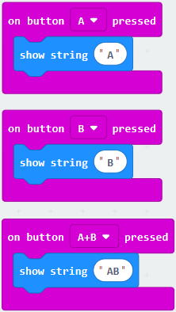 |
|-------------------------------------------------|
|                                                 |

Click“JavaScript" to switch into the corresponding JavaScript code:

**Code 2：**

| Type      | Route                                                           | File Name            |
|-----------|-----------------------------------------------------------------|----------------------|
|  Hex file | ../Makecode Tutorial/Test Code/8.4：Programmable Buttons/Code-2 |  microbit-Code-2.hex |

Or you could edit code step by step in the editing area.

You could edit code step by step in the editing area.

1.  A. Click“Led”→“more”→“led enable false”,

B. Put it into the block“on start”，click drop-down triangle button to
select“true” .

\*\*\*\*\*\*\*\*\*\*\*\*\*\*\*\*\*\*\*\*\*\*\*\*\*\*\*\*\*\*\*\*\*\*\*\*\*\*\*\*\*\*\*\*\*\*\*\*\*\*\*\*\*\*\*\*\*\*\*\*\*\*\*\*\*\*\*\*\*\*\*\*\*

1.  A. Tap“Variables”→“Make a Variable...”→“New variable name：”

B. Enter“item”in the dialog box and click“OK”，then variable“item”is produced.
And move“set item to 0”into“on start”block

1.  A. Click“Input”→“on button A pressed”.

B. Go to“Variables”→“ change item by 1 ”

C. Place it into“on button A pressed”and 1 is modified into
5.

\*\*\*\*\*\*\*\*\*\*\*\*\*\*\*\*\*\*\*\*\*\*\*\*\*\*\*\*\*\*\*\*\*\*\*\*\*\*\*\*\*\*\*\*\*\*\*\*\*\*\*\*\*\*\*\*\*\*\*\*\*\*\*\*\*\*\*\*\*\*\*\*\*

1.  Duplicatecode string
    once，click the drop-down button to select“B”，then set“change item by
    \-5”.

\*\*\*\*\*\*\*\*\*\*\*\*\*\*\*\*\*\*\*\*\*\*\*\*\*\*\*\*\*\*\*\*\*\*\*\*\*\*\*\*\*\*\*\*\*\*\*\*\*\*\*\*\*\*\*\*\*\*\*\*\*\*\*\*\*\*\*\*\*\*\*\*\*\*\*\*\*\*

1.  A. Enter“Led”→“plot bar graph of 0 up to 0”

B. Keep it into“forever”block

C. Go to“Variables”to move“item”into 0 box，change 0 into 25.

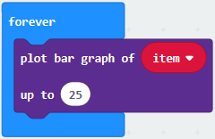

\*\*\*\*\*\*\*\*\*\*\*\*\*\*\*\*\*\*\*\*\*\*\*\*\*\*\*\*\*\*\*\*\*\*\*\*\*\*\*\*\*\*\*\*\*\*\*\*\*\*\*\*\*\*\*\*\*\*\*\*\*\*\*\*\*\*\*\*\*\*\*\*\*\*\*\*\*

1.  A. Go to“Logic”to move out “if...true...then...”and “=”blocks，

B. Keep“=”into“true”box and set to “\>”

C. Select“item”in the“Variables”and lay it down at left box of “\>”，change 0
into 25；

D. Enter“Variables”to drag“set item to 0”block into“if...true..then...”, alter 0
into 25.

\*\*\*\*\*\*\*\*\*\*\*\*\*\*\*\*\*\*\*\*\*\*\*\*\*\*\*\*\*\*\*\*\*\*\*\*\*\*\*\*\*\*\*\*\*\*\*\*\*\*\*\*\*\*\*\*\*\*\*\*\*\*\*\*\*\*\*\*\*\*\*\*\*\*\*\*\*\*

(7) A. Replicate code stringonce

B.“\>”is modified into“\<”and 25 is changed into 0,

C. Leave it beneath code string.

Complete Program：

|  |
|-------------------------------------------------|
|                                                 |

Click“JavaScript" to switch into JavaScript code:

1.  **Test Results：**

Upload code 1 and plug in micro:bit via USB cable, 5×5 LED dot matrix will
show“A”if button A is pressed, in case that button B is pressed,“B”will appear.
So will micro:bit show“AB”if you press A and B buttons simultaneously.

Upload code 2 and plug in board via USB cable. A row of luminous LEDs are added
if button A is pressed, when B pressed, a row of luminous LEDs are deducted.

([How to download?](##A01) [How to quick download?](##_7.3.快速下载))

### 5：Temperature Measurement

1.  **Description：**

Micro:bit main board doesn’t come with temperature sensor actually, but detect
temperature through built-in temperature of NFR51822 chip. Thereby, the detected
temperature is more close to chip’s temperature.

**Note: the temperature sensor of Micro:bit main board is shown below:**

1.  **Experimental Preparation：**

2.  Connect micro:bit to computer with USB cable

3.  Open online Makecode editor.

**Import Hex profile**[**(How to import?)** ](##_7.6.导入代码)**, or click“New
Project”and drag blocks step by step**

1.  **Test Code：**

**Code 1：**

Micro:bit detects temperature

| Type     | Route                                                               | File Name           |
|----------|---------------------------------------------------------------------|---------------------|
| Hex file | ../Makecode Tutorial/Test Code/8.5：Temperature Measurement /Code-1 | microbit-Code-1.hex |

Or you could edit code step by step in the editing area.

1.  Go to“Advanced” →“Serial” →“serial redirect to USB”

Place it into “on start”

\*\*\*\*\*\*\*\*\*\*\*\*\*\*\*\*\*\*\*\*\*\*\*\*\*\*\*\*\*\*\*\*\*\*\*\*\*\*\*\*\*\*\*\*\*\*\*\*\*\*\*\*\*\*\*\*\*\*\*\*\*\*\*\*\*\*\*\*\*\*\*\*\*\*\*\*\*

1.  Click“Serial”to drag out“serial write value x=0”

Move it into“forever”block

1.  Go to“Input” →“temperature(℃)”

Place it into 0 box

Change x into Temperature

\*\*\*\*\*\*\*\*\*\*\*\*\*\*\*\*\*\*\*\*\*\*\*\*\*\*\*\*\*\*\*\*\*\*\*\*\*\*\*\*\*\*\*\*\*\*\*\*\*\*\*\*\*\*\*\*\*\*\*\*\*\*\*\*\*\*\*\*\*\*\*\*\*\*\*\*\*

1.  Move“pause (ms) 100”from“Basic”block and place it under block“serial
    write.....temperature(℃)”

Complete Program：

| 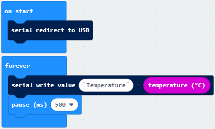   |
|---------------------------------------------------|
|                                                   |

Click“JavaScript" to view the corresponding JavaScript code:

( [How to quick download?](##_7.3.快速下载))

Download code 1 to micro:bit board and keep USB cable connected, then tap button
:

( [How to quick download?](##_7.3.快速下载))

Temperature data is shown below:

Through the test, the room temperature is 35℃when touching the NFR51822 chip of
micro:bit; however, the temperature rises to 37℃ when it touches water cup.

Open CoolTerm, click Options to select SerialPort. Set COM port and 115200 baud
rate(the baud rate of USB serial communication of Micro:bit is 115200 through
the test). Click“OK”and“Connect”.

The serial monitor shows the current ambient temperature value, as shown below:

**Code 2：**

**Micro:bit display different pictures by temperature(the temperature value in
the code could be adjusted)**

| Type     | Route                                                              | File Name           |
|----------|--------------------------------------------------------------------|---------------------|
| Hex file | ../Makecode Tutorial/Test Code/8.5：Temperature Measurement/Code-2 | microbit-Code-2.hex |

Or you could edit code step by step in the editing area.

You could set temperature based on real situation.

1.  Click“Led”→“more”→“led enable false”into“on start”，click drop-down triangle
    button to select“true” 

\*\*\*\*\*\*\*\*\*\*\*\*\*\*\*\*\*\*\*\*\*\*\*\*\*\*\*\*\*\*\*\*\*\*\*\*\*\*\*\*\*\*\*\*\*\*\*\*\*\*\*\*\*\*\*\*\*\*\*\*\*\*\*\*\*

1.  A. Go to“Logic”→“if..true...then...else”and “=” block;

B. Move“if..true...then...else” into“forever”block，then place“=”into“true”box.

\*\*\*\*\*\*\*\*\*\*\*\*\*\*\*\*\*\*\*\*\*\*\*\*\*\*\*\*\*\*\*\*\*\*\*\*\*\*\*\*\*\*\*\*\*\*\*\*\*\*\*\*\*\*\*\*\*\*\*\*\*\*\*\*\*\*\*\*\*\*\*\*\*\*\*\*\*\*

1.  A. Change“=”into“≥”

B. Go to“Input”→“temperature(℃)”and move it into left 0 box;

C. Change 0 into 35.

\*\*\*\*\*\*\*\*\*\*\*\*\*\*\*\*\*\*\*\*\*\*\*\*\*\*\*\*\*\*\*\*\*\*\*\*\*\*\*\*\*\*\*\*\*\*\*\*\*\*\*\*\*\*\*\*\*\*\*\*\*\*\*\*\*

1.  Tap“Basic”→“show icon”，copy it once and lay down them under the“if ...then”
    and else blocks, then click the drop-down triangle button to
    select“”.
    

Complete Program：

| ” |
|--------------------------------------------------------------------------------------------------------------------------------------------------------------------------------------------------------------------------------------------------------------------------------------------------------------------------------------------------------------------------------------------------------------------------|
|                                                                                                                                                                                                                                                                                                                                                                                                                          |

Click“JavaScript", the corresponding JavaScript code is shown below:

**4. Test Results：**

Upload the Code 1 and plug in power. And 5\*5LED displays the ambient
temperature. When pressing the temperature sensor, the temperature will grow on
dot matrix.

Upload the code 2 plug in micro:bit via USB cable, when the ambient temperature
is less than 35℃, 5\*5LED will
show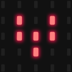. When the temperature is
equivalent to or greater than 35℃, the
pattern will appear.

([How to download?](##A01) [How to quick download?](##_7.3.快速下载))

### 6：Micro:bit’s Compass

**1. Description：**

This project mainly introduces the use of the Micro:bit’s compass. In addition
to detecting the strength of the magnetic field, it can also be used to
determine the direction, an important part of the heading and attitude reference
system (AHRS) as well.  
It uses FreescaleMAG3110 three-axis magnetometer. Its I2C interface communicates
with the outside, the range is ±1000µT, the maximum data update rate is 80Hz.
Combined with accelerometer, it can calculate the position. Additionally, it is
applied to magnetic detection and compass blocks.

Then we could read the value detected by it to determine the location. We need
to calibrate the Micro:bit board when magnetic sensor works.

The correct calibration method is to rotate the Micro:bit board.

In addition, the objects nearby may affect the accuracy of readings and
calibration.

**2. Experimental Preparation：**

1.  Connect micro:bit to computer with USB cable

2.  Open online Makecode editor

**Import Hex profile**[**(How to import?)** ](##_7.6.导入代码)**, or click“New
Project”and drag blocks step by step**

**3. Test Code：**

**Code 1：**

Press A on micro:bit, the value of compass is shown.

| Type     | Route                                                          | File Name            |
|----------|----------------------------------------------------------------|----------------------|
| Hex file | ../Makecode Tutorial/Test Code/8.6：Micro:bit’s Compass/Code-1 |  microbit-Code-1.hex |

Or you could edit code step by step in the editing area.

1.  A. Click“Input”→“more”→“calibrate compass”

B. Lay down it into block“on start”.

1.  A. Go to“Input”→“on button A pressed”.

B. Enter“Basic”→“show number”, put it into“on button A pressed”block;

C. Tap“Input”→“compass heading(℃)”， and place it into“show number”

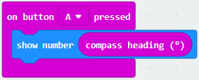

\*\*\*\*\*\*\*\*\*\*\*\*\*\*\*\*\*\*\*\*\*\*\*\*\*\*\*\*\*\*\*\*\*\*\*\*\*\*\*\*\*\*\*\*\*\*\*\*\*\*\*\*\*\*\*\*\*\*\*\*\*\*\*\*\*\*\*\*\*\*\*\*\*\*\*

Complete Program：

|  |
|------------------------------------------------------|
|                                                      |

Click“JavaScript",
and view the corresponding JavaScript code:

**Code Description：**

Upload the code 1, plug in micro:bit via USB cable.

As the button A is pressed, LED dot matrix indicates that“TILT TO FILL
SCREEN”then enter the calibration interface. The calibration method: rotate the
micro:bit to make LED dot matrix draw a square (25 LEDs are on), as shown in the
following figure:

([How to download?](##A01) [How to quick download?](##_7.3.快速下载))

The calibration will be finished until you view the smile
patternappear.

The serial monitor will show 0°, 90°, 180° and 270° when pressing A.

**Code 2：**

Make micro: bit board point to the north, south, east and west horizontally ,
LED dot matrix displays the corresponding direction patterns

| Type     | Route                                                          | File Name            |
|----------|----------------------------------------------------------------|----------------------|
| Hex file | ../Makecode Tutorial/Test Code/8.6：Micro:bit’s Compass/Code-2 |  microbit-Code-2.hex |

  
This code string complies that we read the value detected incessantly and
determine the direction by the value range. The direction is toward North at
this time.

Or you could edit code step by step in the editing area.

1.  

2.  Enter“Input”→ “more”→“calibrate compass”

3.  Move“calibrate compass”into“on start”

\*\*\*\*\*\*\*\*\*\*\*\*\*\*\*\*\*\*\*\*\*\*\*\*\*\*\*\*\*\*\*\*\*\*\*\*\*\*\*\*\*\*\*\*\*\*\*\*\*\*\*\*\*\*\*\*\*\*\*\*\*\*\*\*\*\*\*\*\*\*\*\*\*\*\*\*\*

1.  A. Click “Variables”→“Make a Variable...”→“New variable name：”

B. Input“x”in the blank box and click“OK”, and the variable“x”is generated.

C. Drag out“set x to”into“forever”block

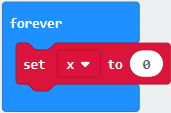

1.  Go to“Input”→“compass heading(℃)”, and keep it into “0” box

Tap“Logic”→“if...then...else”, leave it below block“sex x to compass
heading”，then clickicon for 6
times.

1.  A. Place“and”into “true” block

B. Then move“=”block to the left box of “and”

C. Click“Variables”to drag“x”to the left“0”box, change 0 into 293 and set to“≥”;

D. Then copy“x≥293”once and leave it to the right“0”box and set to“x\<338”

\*\*\*\*\*\*\*\*\*\*\*\*\*\*\*\*\*\*\*\*\*\*\*\*\*\*\*\*\*\*\*\*\*\*\*\*\*\*\*\*\*\*\*\*\*\*\*\*\*\*\*\*\*\*\*\*\*\*\*\*\*\*\*\*\*\*\*\*\*\*\*\*\*\*

1.  A. Go to“Basic”→“show leds”

B. Lay it down beneath block,
then click“show leds”and the pattern
appears.

1.  A. Duplicate for 6 times.

B. Separately leave them into the blank boxes behind“else if”.

C. Set to“x≥23 and x\<68 ”,“x≥68 and x\<113 ”,“x≥113 and x\<158 ”,“x≥158 and
x\<203 ”,“x≥203 and x\<248 ”,“x≥248 and x\<293 ”respectively.

D. Then copy“show leds”for 7 times and keep them below the “else if.......then”
block respectively.

E. Click the blue boxes to form the
pattern“”,
“”,
“”,
“”,
“”,
“”and
“”.

Complete Program：

| pattern appears       |
|-------------------------------------------------------------------------------------------------------------------------------------------------------------------------------------------------------------------------------------------------------------------------------------------------------------------------------------------------------------------------------------------------------------------------------------------------------------------------------------------------------------------------------------------------------------------------------------------------------------------------------------------------------------------------------------------------------------------------------------------------------------------------------------------------------------------------------------------------------------------------------------------------------------------------------------------------------------------------------------------------------------------------------------------------------------------------------------------------------------------------------------------------------------------------|
|  When x is not among the above rang, the next program will be executed under else block                                                                                                                                                                                                                                                                         |

Click“JavaScript" to switch into the corresponding JavaScript code:

1.  **Test Results：**

Download code 2 to micro:bit and keep USB cable connected.

After calibration, tilt Micro:bit board, micro:bit displays the direction signs.

([How to download?](##A01) [How to quick download?](##_7.3.快速下载))

### 7：Accelerometer

**1. Description：**

The micro:bit board has a built-in Freescale MMA8653FC three-axis acceleration
sensor (accelerometer). Its I2C interface works on external communication, the
range can be set to ±2g, ±4g, and ±8g, and the maximum data update rate can
reach 800Hz.  
When the Micro:bit is stationary or moving at a constant speed, the
accelerometer only detects the gravitational acceleration; when the Micro:bit is
slightly shaken, the acceleration detected is much smaller than the
gravitational acceleration and can be ignored. Therefore, in the process of
using Micro:bit, the main purpose is to detect the changes of the gravitational
acceleration on the x, y, and z axes when the attitude changes.  
For this project, we will introduce the detection of several special postures by
the accelerometer.

**2. Experimental Preparation：**

1.  Connect micro:bit to computer with USB cable

2.  Open online Makecode editor

**Import Hex profile**[**(How to import?)** ](##_7.6.导入代码)**, or click“New
Project”and drag blocks step by step**

**3. Test Code：**

**Code 1：**

| Type     | Route                                                    | File Name           |
|----------|----------------------------------------------------------|---------------------|
| Hex file | ../Makecode Tutorial/Test Code/8.7: Accelerometer/Code-1 | microbit-Code-1.hex |

Or you could edit code step by step in the editing area.

(1) A. Enter“Input”→“on shake”，

B. Click“Basic”→“show number”, place it into“on shake”block, then change 0 into
1.

(2) A. Copy code string for 7
times;

1.  separately click the triangle button to select“logo up”,“logo down”,“screen
    up”,“screen down”,“tilt left”,“tilt right”and“free fall”, then respectively
    change 1 into 2, 3, 4, 5, 6, 7, 8.

\*\*\*\*\*\*\*\*\*\*\*\*\*\*\*\*\*\*\*\*\*\*\*\*\*\*\*\*\*\*\*\*\*\*\*\*\*\*\*\*\*\*\*\*\*\*\*\*\*\*\*\*\*\*\*\*\*\*\*\*\*\*\*\*\*\*\*\*\*\*\*\*\*\*\*\*\*\*

Complete Program：

|  |
|--------------------------------------------------------|
|                                                        |

|  |
|-------------------------------------------------|
|                                                 |

Click“JavaScript", you will view the corresponding JavaScript code:

**Code 2：**

Detect the value of acceleration speed at x, y and z axis

| Type     | Route                                                    | File Name           |
|----------|----------------------------------------------------------|---------------------|
| Hex file | ../Makecode Tutorial/Test Code/8.7：Accelerometer/Code-2 | microbit-Code-2.hex |

Or you could edit code step by step in the editing area.

1.  A. Go to“Advanced”→“Serial”→“serial redirect to USB”

B. Drag it into“on start”

\*\*\*\*\*\*\*\*\*\*\*\*\*\*\*\*\*\*\*\*\*\*\*\*\*\*\*\*\*\*\*\*\*\*\*\*\*\*\*\*\*\*\*\*\*\*\*\*\*\*\*\*\*\*\*\*\*\*\*\*\*\*\*\*\*\*\*\*\*\*\*\*\*\*\*\*\*\*

1.  A. Enter“Serial”→“serial write value x =0”

B. Leave it into“forever”block

1.  \*\*\*\*\*\*\*\*\*\*\*\*\*\*\*\*\*\*\*\*\*\*\*\*\*\*\*\*\*\*\*\*\*\*\*\*\*\*\*\*\*\*\*\*\*\*\*\*\*\*\*\*\*\*\*\*\*\*\*\*\*\*\*\*\*\*\*\*\*\*\*\*\*\*A.
    Click“Input”→“acceleration(mg) x”；

B. Keep it into“0”box and capitalize the“x”

\*\*\*\*\*\*\*\*\*\*\*\*\*\*\*\*\*\*\*\*\*\*\*\*\*\*\*\*\*\*\*\*\*\*\*\*\*\*\*\*\*\*\*\*\*\*\*\*\*\*\*\*\*\*\*\*\*\*\*\*\*\*\*\*\*\*\*\*\*\*\*\*\*\*\*\*\*

1.  Go to“Basic”and move out“pause (ms) 100”below the
    block, then set to 100ms.

    

\*\*\*\*\*\*\*\*\*\*\*\*\*\*\*\*\*\*\*\*\*\*\*\*\*\*\*\*\*\*\*\*\*\*\*\*\*\*\*\*\*\*\*\*\*\*\*\*\*\*\*\*\*\*\*\*\*\*\*\*\*\*\*\*\*\*\*\*\*\*\*\*\*\*\*\*\*

1.  Replicate code string

for 3 times and keep them into“forever”block，separately set the whole code
string as follows:

Complete Program：

Click“JavaScript" to view the corresponding JavaScript code:

([How to quick download?](##_7.3.快速下载))

Download code 1 to micro:bit board, keep USB cable connected and
click

([How to quick download?](##_7.3.快速下载))

The coordinates of the Micro:bit accelerometer are shown in the following
figure:

The decomposition value of acceleration on the X-axis, Y-axis, and Z-axis, as
well as the synthesis of acceleration (the synthesis of gravitational
acceleration and other external forces). Then flip the micro:bit board, the data
is shown below:

Open CoolTerm, click Options to select SerialPort. Set COM port and 115200 baud
rate(the baud rate of USB serial communication of Micro:bit is 115200 through
the test). Click“OK”and“Connect”.

CoolTerm serial monitor displays the acceleration value on x, y and z axis.

**4. Test Results：**

Download code 1 to micro:bit board and keep USB cable connected, shake the
Micro:bit board then the number 1 appears.

([How to download?](##A01) [How to quick download?](##_7.3.快速下载))

Place micro:bit vertically(logo up), then the number 2 is displayed:

Place micro:bit vertically(logo down), then the number 3 is displayed:

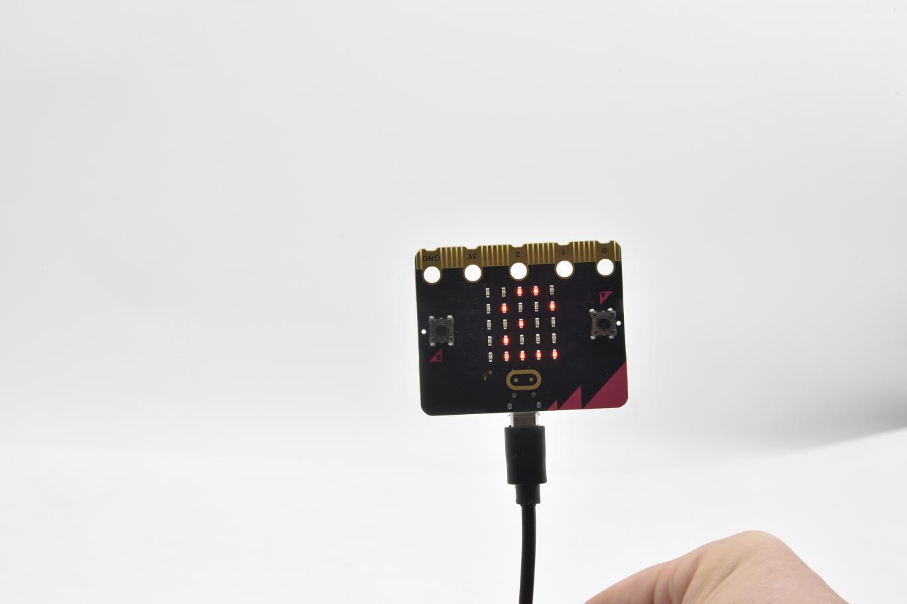

Place micro:bit horizontally (facing up), then the number 4 is displayed:

On the contrary, place micro:bit horizontally (facing down), then the number 5
is displayed:

When Micro:bit board is tilt to the left, number 6 is shown.

When Micro:bit board is inclined to the right, number 7 is displayed.

When it is free fall(accidentally making it fall), number 8 appears on dot
matrix.（Note：we don’t recommend you to make it free fall, it will make board
damage)

### 8：Detect Light Intensity by Micro:bit

1.  **Description：**

This project will introduce how Micro:bit detects the external light intensity.
Since Micro:bit doesn’t come with a photosensitive sensor, the detection of
light intensity is completed through the LED matrix. When the light irradiates
the LED matrix, the voltage change will be produced. Therefore, we could
determine the light intensity by voltage change.

1.  **Experimental Preparation：**

2.  Connect micro:bit to computer with USB cable

3.  Open online Makecode editor

**Import Hex profile** [**(How to import?)** ](##_7.6.导入代码)**, or click“New
Project”and drag blocks step by step.**

**3. Test Code：**

| Type     | Route                                                                   | File Name                                         |
|----------|-------------------------------------------------------------------------|---------------------------------------------------|
| Hex file | ../Makecode Tutorial/Test Code/8.8：Detect Light Intensity by Micro:bit | microbit-Detect Light Intensity by Micro:bit .hex |

Or you could edit code step by step in the editing area.

(1)A. Enter“Advanced”→“Serial”→“serial redirect to USB”;

B. Drag it into“on start”block.

\*\*\*\*\*\*\*\*\*\*\*\*\*\*\*\*\*\*\*\*\*\*\*\*\*\*\*\*\*\*\*\*\*\*\*\*\*\*\*\*\*\*\*\*\*\*\*\*\*\*\*\*\*\*\*\*\*\*\*\*\*\*\*\*\*\*\*\*\*\*\*\*\*\*\*

(2) A. Go to“Serial”→“serial write value x =0”;

B. Move it into“forever”

1.  A. Click“Input”→“acceleration(mg) x”

B. Put“acceleration(mg) x”in the“0”box and change “x”into“Light intensity”.

\*\*\*\*\*\*\*\*\*\*\*\*\*\*\*\*\*\*\*\*\*\*\*\*\*\*\*\*\*\*\*\*\*\*\*\*\*\*\*\*\*\*\*\*\*\*\*\*\*\*\*\*\*\*\*\*\*\*\*\*\*\*\*\*\*\*\*\*\*\*\*\*\*\*\*

1.  A. Click“Basic”→“pause (ms) 100”;

B. Lay it down into“forever”and set to 100ms.

\*\*\*\*\*\*\*\*\*\*\*\*\*\*\*\*\*\*\*\*\*\*\*\*\*\*\*\*\*\*\*\*\*\*\*\*\*\*\*\*\*\*\*\*\*\*\*\*\*\*\*\*\*\*\*\*\*\*\*\*\*\*\*\*\*\*\*\*\*\*\*\*\*\*\*

1.  Complete Program：

|    |
|---------------------------------------------------|
|                                                   |

Click“JavaScript" to switch into the corresponding JavaScript code:

**5. Test Results：**

Download code to micro:bit board don’t plug off USB cable and
click

([How to quick download?](##_7.3.快速下载))

The intensity value is 0 when covering LED dot matrix. And the value varies with
the light intensity. When placing micro:bit under the sunlight, the stronger the
light is, the larger the intensity value is. As shown below:

Open“CoolTerm”, click“Options”to select “SerialPort”, and set “COM” port and
115200 baud rate(the baud rate of USB serial communication of micro:bit is
115200 through the test).

Then click“OK”and“Connect”.

The light intensity value is shown below:

### 9: Speaker

**1. Description:**

The Micro: Bit main board V2 has an built-in speaker, which makes adding sound
to the programs easier. We can program the speaker to air all kinds of tones
,such as playing the song, "Ode to Joy" .

**2.Experimental Preparation：**

Connect micro:bit to computer with USB cable

Open online Makecode editor

**Import Hex profile** [**(How to import?)** ](##_7.6.导入代码)**, or click“New
Project”and drag blocks step by step.**

**3. Test Code：**

| Type     | Route                                                    | File Name                          |
|----------|----------------------------------------------------------|------------------------------------|
| Hex file | ../Makecode Tutorial/Test Code/8.9：Speaker by Micro:bit | microbit-Speaker by Micro:bit .hex |

Or you could edit code step by step in the editing area.

1.  Enter“Basic”module to find “show icon”and drag it into“on start”block;

Click the little triangle to find
“”

\*\*\*\*\*\*\*\*\*\*\*\*\*\*\*\*\*\*\*\*\*\*\*\*\*\*\*\*\*\*\*\*\*\*\*\*\*\*\*\*\*\*\*\*\*\*\*\*\*\*\*\*\*\*\*\*\*\*\*\*\*\*\*\*\*\*\*\*\*\*\*\*\*\*\*\*\*\*

(2) Enter“Music”module to find and drug“play sound giggle until done” into
“forever”block;

Enter“Basic”module to find and drug“pause(ms) 100” into “forever” block ;

Change 100 into 1000;

( 3 ) Copy  three times and place
it into “forever” block ;

Click the little triangle to select “happy”,”hello”,”yawn”;

\*\*\*\*\*\*\*\*\*\*\*\*\*\*\*\*\*\*\*\*\*\*\*\*\*\*\*\*\*\*\*\*\*\*\*\*\*\*\*\*\*\*\*\*\*\*\*\*\*\*\*\*\*\*

Complete Program：

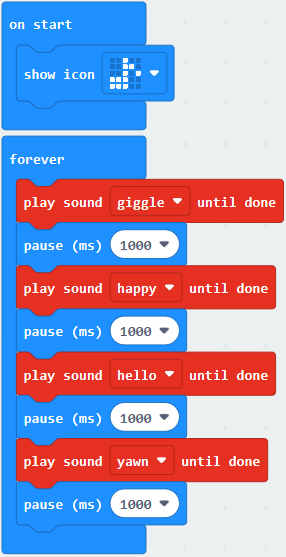

Select “JavaScript" and “Python” to switch into JavaScript and Python language
code:

**4.Test Results:**

After uploading the test code to micro:bit main board V2 and powering the board
via the USB cable, the speaker utters sound and the LED dot matrix shows the
logo of music.

### 10: Touch-sensitive Logo

**1. Description:**

The Micro: Bit main board V2 is equipped with a golden touch-sensitive logo,
which can act as an input component and function like an extra button.

It contains a capacitive touch sensor that senses small changes in the electric
field when pressed (or touched), just like your phone or tablet screen do.When
you press it , you can activate the program.

**2.Experimental Preparation：**

Connect micro:bit to computer with USB cable

Open online Makecode editor

**Import Hex profile** [**(How to import?)** ](##_7.6.导入代码)**, or click“New
Project”and drag blocks step by step.**

**3. Test Code：**

| Type     | Route                                                                  | File Name                                       |
|----------|------------------------------------------------------------------------|-------------------------------------------------|
| Hex file | ../Makecode Tutorial/Test Code/8.10：Touch-sensitive logo by Micro:bit | microbit-Touch-sensitive logo by Micro:bit .hex |

Or you could edit code step by step in the editing area.

( 1 ) Delete block“on start”and“forever”;

( 2 )Enter“Input”module to find and drag“on logo pressed” ;

Click the little triangle to find“touched”;

( 3 ) Enter module“Variables”→choose“Make a Variable”→input“start”→click“OK”

The variable“start”is established;

Enter“Variables”module to find and drag “set start to 0” into “on logo
touched”block;

( 4 )Enter“Input”module →click “more”→ find and drag“running time(ms)”into
the“0”of“set start to 0”block;

( 5 )Enter“Basic”module to find and drag“show
icon” into “on logo
touched”block;

( 6 )Enter“Input”module to find and drag“on logo pressed”→choose “released”→
establish variable “time”;

Enter“Variables”module to find and drag “set time to 0”into “on logo
pressed”block;

Enter“Math”module to find and drag “0-0”into the “0”of“set start to 0”block;

( 7 )Enter“Input”module→ “more” → find and drag “running time(ms)” into “0”on
the left side of “0-0”;

Enter“Variables”module to find and drag“start” into “0”on the right side of
“0-0”;

( 8 )Enter“Basic”module to find and drag“show number” into “on logo
released”block;

Enter“Math”module to find and drag“square root 0” into“0”; Click the little
triangle to find”integer÷”;

( 9 ) Enter“Variables”module to find and drag“time”into“0”on the left side
of“0-0”and change the“0”on the right side to”1000”;

Complete Program：

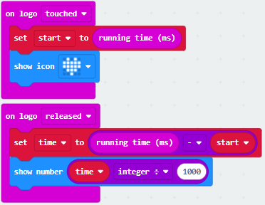

Select“JavaScript" and“Python”to switch into JavaScript and Python language
code:

**4.Test Results:**

After uploading the test code to micro:bit main board V2 and powering the board
via the USB cable, the LED dot matrix exhibits the heart pattern when the
touch-sensitive logo is pressed or touched and displays digit when the logo is
released.

### 11: Microphone

**1.Description:**

The Micro: Bit main board V2 is built with a microphone which can test the
volume of ambient environment. When you clap, the microphone LED indicator will
turn on. Since it can measure the intensity of sound, you can make a noise scale
or disco lighting changing with music. The microphone is placed on the opposite
side of the microphone LED indicator and in proximity with holes that lets sound
pass.When the board detects sound, the LED indicator lights up.

**2.Experimental Preparation：**

Connect micro:bit to computer with USB cable

Open online Makecode editor

Import Hex profile [(How to import?)](##_7.6.导入代码) , or click“New Project”and
drag blocks step by step.

3\. Test Code：

| Type     | Route                                                        | File Name                                  |
|----------|--------------------------------------------------------------|--------------------------------------------|
| Hex file | ../Makecode Tutorial/Test Code/8.11：Microphone by Micro:bit | microbit-Microphone logo by Micro:bit .hex |

Or you could edit code step by step in the editing area.

(1 ) Delete block“on start”and“forever”;

( 2 ) Enter“Input”module to find and drag“on loud sound”;

Enter“Basic”module to find and drag “show number”into “on loud sound”block ;

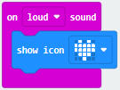

( 3 )Copy  once;

Click the little triangle of “lond” to choose”quiet”;

Click the little triangle of “”
to choose””;

Complete Program：

Select“JavaScript" and“Python”to switch into JavaScript and Python language
code:

4.Test Results 1:

After uploading test code to micro:bit main board V2 and powering the board via
the USB cable.

The LED light will display“”when
you clap your hands and  will
appear when the environment is quiet

5.Test Code 2:

Link computer with micro:bit board by micro USB cable, and program in MakeCode
editor,

( 1 )Enter“Advanced”module→ choose“Serial”to find and drag“serial redirect to
USB”into “on start”block ;

( 2 )Enter“Variables”module→ choose“Make a Variable”→ input “maxSound”→click
“OK”,variable ”maxSound”is established;

Enter“Variables”module to find and drag“set maxSound to 0”into “on start”block ;

( 3 )Enter“Logic”module to find and drag“if true then...else”into “forever”
block ;

Enter“Input”module to find and dragbutton A is pressed”into “then” ;

( 4 )Enter“Basic”module to find and drag“show number”into“then” ;

Enter“Variables”module to find and drag“maxSound”into“0” ;

1.  Establish variable“soundLevel”;

Enter“Variables”module to find and drag“set soundLevel to 0”into “else”;

Enter“Input”module to find and drag“sound level” into “0”;

( 6 )Enter“Led”module to find and drag“plot bar graph of 0 up to 0” into “else”;

Enter“Variables”module to find and drag“soundLevel”into the“0”behind “of”;

Change the “0”behind “up” to“255”;

( 7 )Enter“Logic”module to find and drag“if true then”into “else”block ;

Enter“Logic”module to find and drag“0 \> 0”into “then” ;

Enter“Variables”module to find and drag“soundLevel”into“0”on the left side of
“0-0” ;

Enter“Variables”module to find and drag“maxSound”into“0”on the right side;

( 8 )Enter“Variables”module to find and drag“set maxSound to 0”into the second
“then” ;

Enter“Variables”module to find and drag“soundLevel”into the “0” ;

Complete Program：

Select“JavaScript" and“Python”to switch into JavaScript and Python language
code:

1.  **Test Results 2:**

Upload test code to micro:bit main board V2, power the board via the USB cable
and click Show console Device”as shown below.

When the sound is louder around, the sound value shows in the serial port is
bigger as shown below.

What’s more, when pressing the button A, the LED dot matrix displays the value
of the biggest volume( please note that the biggest volume can be reset via the
Reset button on the other side of the board ) while when clapping, the LED dot
matrix shows the pattern of the sound.

### 12: Bluetooth Wireless Communication

**1.Project Description:**

The Micro: Bit main board V2 comes with a nRF52833 processor (with built-in
Bluetooth 5.1 BLE(Bluetooth Low Energy) device) and a 2.4GHz antenna for
Bluetooth wireless communication and 2.4GHz wireless communication. With the
help of them, the board is able to communicate with a variety of Bluetooth
devices, including smart phones and tablets.

In this project, we mainly concentrate on the Bluetooth wireless communication
function of this main board. Linked with Bluetooth, it can transmit code or
signals. To this end, we should connect an Apple device (a phone or an iPad) to
the board.

Since setting up Android phones to achieve wireless transmission is similar to
that of Apple devices, no need to illustrate again.

**2. Preparation**

\*Attach the Micro:bit main board V2 to your computer via the Micro USB cable.

\*An Apple device (a phone or an iPad) or an Android device;

**3. Procedures:**

For Apple devices, enter this link:

<https://www.microbit.org/get-started/user-guide/ble-ios/> with your computer
first, and then click “Download pairing HEX file”to download the Micro: Bit
firmware to a folder or desk, and upload the downloaded firmware to the Micro:
Bit main board V2.

Search“micro bit”in your App Store to download the APP micro:bit.

Connect your Apple device with Micro: Bit main board V2:

Firstly, turn on the Bluetooth of your Apple device and open the APP micro:bit
to select item “Choose micro:bit”to start pairing Bluetooth.

Please make sure that the Micro: Bit main board V2 and your computer are still
linked via the USB cable.

Secondly, click“Pair a new micro:bit”;

Following the instructions to press button A and B at the same time(do not
release them until you are told to) and press Reset & Power button for a few
seconds.

Release the Reset & Power button, you will see a password pattern shows on the
LED dot matrix. Now , release buttons A and B and click Next.

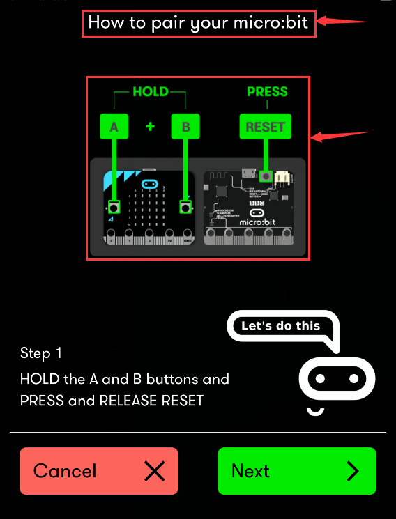

Set the password pattern on your Apple device as the same pattern showed on the
matrix and click Next.

Still click Next and a dialog box props up as shown below. Then click "Pair". A
few seconds later, the match is done and the LED dot matrix displays the "√"
pattern.

After the match with Bluetooth, write and upload code with the App.

Click“Create Code”to enter the programming page and write code.

Click  and the box
 appears, and then select“Create
√”.

Name the code as“1”and click  to
save it.

Click the third item“Flash”to enter the uploading page. The default code program
for uploading is the one saved just now and named "1" and then click the other
"Flash" to upload the code program "1".

If the code is uploaded successfully a few seconds later, the App will emerge as
below and the LED dot matrix of the Micro: Bit main board V2 will exhibit a
heart pattern.

Projects above all conduct with the built-in sensors and the LED dot matrix of
the main board while the following ones will carry out with the help of external
sensors of this turtle car.

**（Attention：to avoid burning the the Micro:bit main board V2, please remove
the USB cable and the external power from the board before fix it with the
shield of the car; likewise, the USB cable and the external power should be cut
from the main board before disconnect the shield from the board.)**

### 13: Passive Buzzer

1.  **Description：**

We can use Micro:bit board to make many interactive works of which the most
commonly used is acoustic-optic display. The previous lessons are related to
LED. However, we will elaborate the Sound in this lesson.

Buzzer is inclusive of active buzzer and passive buzzer.

The passive buzzer doesn’t carry with vibrator inside, so it need external sine
or square wave to drive. It can produce slight sound when connecting directly to
power supply. It features controlling sound frequency and producing the sound
of“do re mi fa so la si”.

A diode should be connected in reverse when driving by the square wave signal
source, which will hinder the high-voltage generated to damage other components
or service life when the power breaks down.

Frequency is made of a series of pitch names in English letters and Numbers. You
can choose different frequencies, that is, tone. The frequency of sound is
called pitch.

It involves music knowledge. In music lesson, our teacher taught“1（Do）,
2（Re）, 3(Mi), 4(Fa) , 5(Sol), 6(La), 7(Si)”

| 1（Do） | 2（Re） | 3(Mi) | 4(Fa) | 5(Sol) | 6(La) | 7(Si) |
|---------|---------|-------|-------|--------|-------|-------|
| C       | D       | E     | F     | G      | A     | B     |

The number depends on high or low tone. The larger the number, the higher the
tone. When the number is the same, the frequency (tone) is getting higher and
higher from C to \_B.

Beats are the time delay for each note. The larger the number, the longer the
delay time. A note without a line in the spectrum is a beat, with a delay of
1000 milliseconds. while a beat with an underline is 1/2 of a beat without a
line, and a beat with two underlines is 1/4 of a beat without a line.

（）

Here is the notation of Ode to Joy.

**2. Experimental Preparation：**

1.  Insert micro:bit board into slot of V2 shield.

2.  Place batteries into battery holder.

3.  Dial POWER switch to ON end

4.  Connect micro:bit to computer by USB cable and open online Makecode editor.

Import Hex profile [**(How to import?)** ](##_7.6.导入代码) , or click“New
Project”and drag blocks step by step(add turtle-bit extension library first)

[**(How to add turtle-bit extension?)**](##M11)

1.  **Test Code：**

| Type     | Route                                               | File Name                   |
|----------|-----------------------------------------------------|-----------------------------|
| Hex file | ../Makecode Tutorial/Test Code/8.13：Passive Buzzer | microbit-Passive Buzzer.hex |

Or you could edit code step by step in the editing area.

1.  Click “Led”→”more”→“led enable false”, combine it with“on
    start”.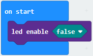

\*\*\*\*\*\*\*\*\*\*\*\*\*\*\*\*\*\*\*\*\*\*\*\*\*\*\*\*\*\*\*\*\*\*\*\*\*\*\*\*\*\*\*\*\*\*\*\*\*\*\*\*\*\*\*\*\*\*\*\*\*\*\*\*\*\*\*\*\*\*\*\*\*

1.  Enter“Music”→“play tone Middle C for 1 beat”， leave it
    into“forever”block，then tap “Middle C”, then
    appearcode.

Choose“High E”and set to“1 beat”.

.

1.  According to the above music score. Copy“play tone High E for 1 beat”124
    times，separately change “High E”of“play tone High E for 1 beat”into“High
    E”,“High F”,“High G”,“High G”,“High F”,“High E”,“High D”,“High C”,“High
    C”,“High D”,“High E”,“High E”,“High D”,“High D”,“High E”,“High E”,“High
    F”,“High G”,“High G”,“High F”,“High E”,“High D”,“High C”,“High C”,“High
    D”,“High E”,“High D”,“High C”,“High C”,“High D”,“High D”,“High E”,“High
    C”,“High D”,“High E”,“High F”,“High E”,“High C”,“High D”,“High E”,“High
    F”,“High E”,“High D”,“High C”,“High D”,“Middle G ”,“High E”,“High E”,“High
    E”,“High F”,“High G”,“High G”,“High F”,“High E”,“High D”,“High C”,“High
    C”,“High D”,“High E”,“High D”,“High C”,“High C”,“High D”,“High D”,“High
    E”,“High C”,“High D”,“High E”,“High F”,“High E”,“High C”,“High D”,“High
    E”,“High F”,“High E”,“High D”,“High C”,“High D”,“Middle G”,“High E”,“High
    E”,“High E”,“High F”,“High G”,“High G”,“High F”,“High E”,“High C”,“High
    C”,“High C”,“High D”,“High E”,“High D”,“High C”,“High C”,“High D”,“High
    C”,“High C”,“High G”,“High F”,“High E”,“High E”,“High C”,“High B”,“High
    A”,“High A”,“High F”,“High D”,“High C”,“Middle B”,“High D”,“Middle
    B”,“Middle A”,“Middle G”,“Middle A”,“Middle B”,“High C”,“High E”,“High
    D”,“Middle B”,“High C”,“High C”,“High C”,“High C”.

Then set beat
to“1”,“1”,“1”,“1”,“1”,“1”,“1”,“1”,“1”,“1”,“1”,“1”,“1/2”,“1”,“1”,“1”,“1”,“1”,“1”,“1”,“1”,“1”,“1”,“1”,“1”,“1”,“1”,“1/2”,“1”,“1”,“1”,“1”,“1”,“1”,“1/2”,“1/2”,“1”,“1”,“1”,“1/2”,“1/2”,“1”,“1”,“1”,“1”,“1”,“1”,“1”,“1”,“1”,“1”,“1”,“1”,“1”,“1”,“1”,“1”,“1”,“1”,“1”,“1/2”,“1”,“1”,“1”,“1”,“1”,“1”,“1/2”,“1/2”,“1”,“1”,“1”,“1/2”,“1/2”,“1”,“1”,“1”,“1”,“1”,“1”,“1”,“1”,“1”,“1”,“1”,“1”,“1”,“1”,“1”,“1”,“1”,“1”,“1”,“1/2”,“1”,“1”,“1/2”,“1”,“1”,“1”,“1/2”,“1”,“1”,“1”,“1/2”,“1”,“1/2”,“1/2”,“1/2”,“1/2”,“1/2”,“1/2”,“1/2”,“1/2”,“1/2”,“1/2”,“1/2”,“1/2”,“1/2”,“1/2”,“1”,“1/2”,“1/4”,“1”.

Complete Program：

|  |
|------------------------------------------------------------------------------------------------|
|                                                                                                |

|  |
|------------------------------------------------------------------------------------------------|
|                                                                                                |

|  |
|------------------------------------------------------------------------------------------------|
|                                                                                                |

| 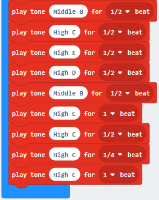 |
|-------------------------------------------------|
|                                                 |

Click“JavaScript", you will view the corresponding JavaScript code:

**4 .Test Results：**

Download code to micro:bit board and dial POWER switch to ON end. The“Ode to
Joy” is played by passive buzzer

([How to download?](##A01) [How to quick download?](##_7.3.快速下载))

### 14: RGB Experiments

1.  **Description：**

The RGB color mode is a color standard in the industry. It obtains various
colors by changing the three color channels of red (R), green (G), and blue (B)
and integrating them. RGB denotes the three colors of red, green and blue.  
The monitors mostly adopt the RGB color standard, and all the colors on the
computer screen are composed of the three colors of red, green and blue mixed in
different proportions. A group of red, green and blue is the smallest display
unit. Any color on the screen can be recorded and expressed by a set of RGB
values.

Each of the three color channels of red, green, and blue is divided into 256
levels of brightness. At 0, the "light" is the weakest-it is turned off, and at
255, the "light" is the brightest. When the three-color gray values are the
same, the gray tones with different gray values are produced, that is, when the
three-color gray is 0, the darkest black is generated; when the three-color gray
is 255, it is the brightest white tone .

| Color                                     | RGB value（R,G,B） | Color code | Color    | RGB value（R,G,B） | Color code |
|-------------------------------------------|--------------------|------------|----------|--------------------|------------|
| Black                                     | 0,0,0              | \##000000   | Red      | 255,0,0            | \##FF0000   |
| Green                                     | 0,255,0            | \##00FF00   | Blue     | 0,0,255            | \##0000FF   |
| indigo                                    | 0,255,255          | \##00FFFF   | Dark red | 255,0,255          | \##FF00FF   |
| Yellow                                    | 255,255,0          | \##FFFF00   | White    | 255,255,255        | \##FFFFFF   |
| ......                                    | .......            | ......     | ......   | ......             | ......     |
| Adjust the numbers to get gradient colors |                    |            |          |                    |            |

RGB colors are called additive colors since the adding of R, G, and B together
(that is, all light reflect back to the eye) produces white color. Additive
colors are used for lighting, television and computer displays. For example,
displays produce color by emitting red, green, and blue rays. Most visible
spectra can be expressed as a mixture of red, green and blue (RGB) light in
different proportions and intensities. If these colors overlap, they produce
cyan, magenta and yellow.

We will make two experiments, one is that two RGB LEDs light up red, green,
blue, indigo, dark red, yellow and white color, another one is that RGB lights
display color in gradient way.

**2. Experimental Preparation：**

(1) Insert micro:bit board into slot of V2 shield.

(2) Place batteries into battery holder.

(3) Dial power switch to ON end

(4) Connect micro:bit to computer by USB cable and open online Makecode editor.

Import Hex profile [**(How to import?)** ](##_7.6.导入代码) , or click“New
Project”and drag blocks step by step(add turtle-bit extension library first)

[**(How to add turtle-bit extension?)**](##M11)

**3. Test Code：**

**Code 1**

RGB lights show seven colors

| Type     | Route                                                       | File Name           |
|----------|-------------------------------------------------------------|---------------------|
| Hex file | ../Makecode Tutorial/Test Code/8.14：RGB Experiments/Code-1 | microbit-Code-1.hex |

Or you could edit code step by step in the editing area.

1.  Click“TurtleBit”to drag“LED brightness 0”into“on start”block

The larger the number you set, the brighter the RGB gets

Here, we set to 70

1.  Click“TurtleBit”to drag“set RGBled left_side R：0 G：0 B：0”block
    into“forever”

Set R:255 G:0 B:0

(3)Click“TurtleBit”to move“set RGBled left_side R：0 G：0 B：0”
into“forever”block.

Tap left_side to choose right_side, change R:0 into R:255

(4) Click“Basic”to drag“pause (ms) 100”block into“forever”

Delay in 1000ms

(5) Copy code stringfor six times
and separately place them into“forever”block.

Respectively set to“R：0 G：255 B：0”,“ R：0 G：0 B：255”,“ R：0 G：255
B：255”,“ R：255 G：0 B：255”,“ R：255 G：255 B：0” and “ R：255 G：0 B：255”.

Complete Code

|        |
|-----------------------------------------------------------------------------------------------------------------------------------------------------|
|                                                                                                                                                     |

Click“JavaScript" to switch into the corresponding JavaScript code:

**Code 2：**

| Type     | Route                                                       | File Name           |
|----------|-------------------------------------------------------------|---------------------|
| Hex file | ../Makecode Tutorial/Test Code/8.14：RGB Experiments/Code-2 | microbit-Code-2.hex |

Or you could edit code step by step in the editing area.

1.  Go to“TurtleBit”to move block“LED brightness 0”into“on start”

Change 0 into 200

1.  Go to“Variables” →“Make a Variable...”→“New variable name：” dialog box，

2.  Input“led-r”and click“OK”to produce variable“led-r”，

Then set variable“led-g”and“led-b”in same way.

Move block“set led-b to 0”into“on start”

Copy“set led-b to 0”block twice and set to led-r, led_g and led_b

1.  Go to“Loops”to drag block“repeat 4 times do”into“forever”

1.  Tap“TurtleBit”to drag block“set RGBled left_side R：0 G：0 B：0”into “repeat
    4 times do”block.

Copy it once, and change blocks as follows:

1.  Move block“pause (ms) 100”from“Basic”and place it into“repeat 4 times do”.

1.  Enter“Variables”to move block“change led-b by 1”under block“pause (ms) 100”.

Click triangle to change led-b into led-r.

The R value is in the range of 0-255, and we make variable“led-r”increases by 5
every time. Therefore, 51 times in total.

Set“repeat 51 times”and“by 5”.

1.  Copy code string once and
    leave it into“forever”.

To make RGB get darker gradually, we set“led-r by -5”, 51 times in total

So we change 5 into -5.

1.  Replicate once and keep them
    into“forever”block. Set R:0 and G: led-g, as shown below:

1.  Copyagain, and set code
    string as follows:

    

Complete Code

|  |
|--------------------------------------------------------------------------------------------------------------------------------------------------------------------------------------------------|
|                                                                                                                                                                                                  |

Click“JavaScript" to switch into the corresponding JavaScript code:

**4.Test Results：**

([How to download?](##A01) [How to quick download?](##_7.3.快速下载))

Download code 1 to micro:bit board and dial POWER switch to ON end, 2 RGB lights
of smart car emit red, green, blue, indigo, dark red, yellow and white color
cyclically.

Download code 2 to micro:bit board, 2 RGB lights show different color
cyclically.

([How to download?](##A01) [How to quick download?](##_7.3.快速下载))

### 15: WS2812 RGB

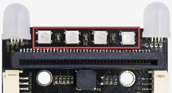

**1.Description：**

The driver shield cooperates 4 pcs WS2812 RGB LEDs, compatible with micro:bit
board and controlled by P8. In this lesson, we will make RGB LEDs display
different colors by P8

**2. Experimental Preparation：**

(1) Insert micro:bit board into slot of V2 shield.

(2) Place batteries into battery holder.

(3) Dial power switch to ON end

(4) Connect micro:bit to computer by USB cable and open online Makecode editor.

Import Hex profile [**(How to import?)** ](##_7.6.导入代码) , or click“New
Project”and drag blocks step by step(add turtle-bit extension library first)

[**(How to add turtle-bit extension?)**](##M11)

**3. Test Code：**

**Code 1：**

| Type     | Route                                                  | File Name           |
|----------|--------------------------------------------------------|---------------------|
| Hex file | ../Makecode Tutorial/Test Code/8.15：WS2812 RGB/Code-1 | microbit-Code-1.hex |

Or you could edit code step by step in the editing area.

1.  a. Enter“Neopixel” →“set strip to Neopixel at pin P0 with 24 leds as RGB
    (GRB format)”

b. Place it into“on start”block，

c. Signal end P8 of WS2812 RGB is controlled by P8 of micro:bit . So we set to
P8.

d. Smart car has 4 pcs WS2812 RGB lights, so set to 4 leads

1.  Click“Neopixel”to move block“strip clear”into“on start”block.

    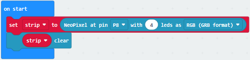

2.  Enter“Neopixel”to move block“strip show color red” into “forever” block

    

3.  Click“Basic”to move“pause (ms) 100”block into“forever”block

Then set to 1000ms

1.  Copy code string 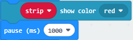for eight
    times, and click red to respectively set to orange, yellow, green, blue,
    indigo, violet, purple and white.

1.  Tap the triangle icon to select orange, yellow, green, blue, indigo, violet,
    purple and white.

Complete Code

|      |
|-----------------------------------------------------|
|                                                     |

Click“JavaScript" to switch into the corresponding JavaScript code:

**Code 2：**

| Type     | Route                                                  | File Name           |
|----------|--------------------------------------------------------|---------------------|
| Hex file | ../Makecode Tutorial/Test Code/8.15：WS2812 RGB/Code-2 | microbit-Code-2.hex |

1.  a. Enter“Neopixel” →“set strip to Neopixel at pin P0 with 24 leds as RGB
    (GRB format)”

b. Place it into“on start”block，

c. Signal end P8 of WS2812 RGB is controlled by P8 of micro:bit . So we set to
P8.

d. Smart car has 4 pcs WS2812 RGB lights, so set to 4 leads

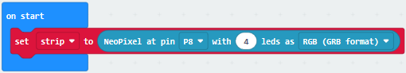

1.  Click“Loops”to drag“for index from 0 to 4...do”into“forever”block

Change 4 into 3

1.  Click“Neopixel”to move block“strip clear”into block“for index from 0 to
    3...do”

1.  Tap“Neopixel”→“more”→“strip set pixel color at 0 to red”

Place it into“for index from 0 to 3...do”block

Click“Variables”to move“index”into 0 box

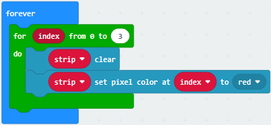

(5) Click“Neopixel”to move“strip show”into“for index from 0 to 3...do” block

(6) Tap“Basic”to move “pause (ms) 100”block into“index from 0 to 3...do”

1.  Replicate code string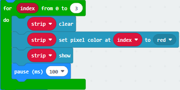for
    eight times and place them into“forever”block

Click red to respectively choose orange, yellow, green, blue, indigo, violet,
purple and white

Complete Code：

|   |
|------------------------------------------------------------------------------------------------------------------------------------------------------|
|                                                                                                                                                      |

Click“JavaScript" to switch into the corresponding JavaScript code:

**Code 3：**

| Type     | Route                                                  | File Name           |
|----------|--------------------------------------------------------|---------------------|
| Hex file | ../Makecode Tutorial/Test Code/8.15：WS2812 RGB/Code-3 | microbit-Code-3.hex |

Or you could edit code step by step in the editing area.

1.  a. Enter“Neopixel” →“set strip to Neopixel at pin P0 with 24 leds as RGB
    (GRB format)”

b. Place it into“on start”block，

c. Signal end P8 of WS2812 RGB is controlled by P8 of micro:bit . So we set to
P8.

d. Smart car has 4 pcs WS2812 RGB lights, set to 4 leads

1.  Click“Variables”→“Make a Variable...”

Input R to build up variable R

We create variable“G”and“B”in same way

Drag“set B to 0”into“on start”block

Copy“set B to 0”twice and click triangle button to choose G and B

1.  Click“Loops”to get block“for index from 0 to 4...do”

Leave it into “forever”and change 4 into 3

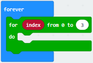

1.  Move block“set B to 0”into“for index from 0 to 3...do”block,

Click B to choose R

Go to“Math”to drag block“pick random 0 to 10”into 0 box

Change 0 into 10, 10 into 255

1.  Replicate block twice and
    place them into“for index from 0 to 3...do”block.

Click R to select G and B

1.  Tap“Neopixel”and move“strip clear”into“for index from 0 to 3...do” block.

    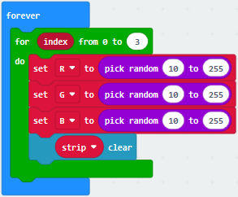

2.  Go to“Neopixel”→“more”→“strip set pixel color at 0 to red”

Leave it in the block“for index from 0 to 3...do”block

Drag block“red 255 green 255 blue 255”into“red”box

Tap“Variables”to move“index”block into 0 box

Separately drag R , G and B into 255 box, as shown below:

1.  Click“Basic”to drag“pause (ms) 100” under block “strip.....B”

Set to 500ms.

1.  Click“Neopixel”to move“strip show”block under “pause(as) 500”

    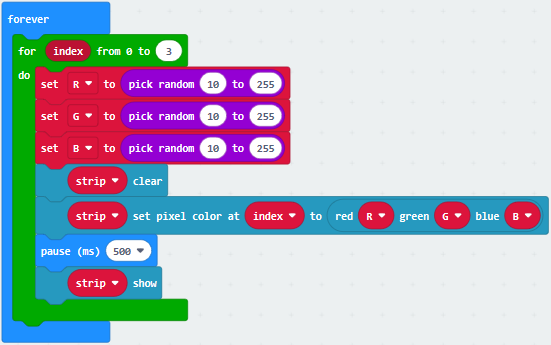

Complete Code:

| 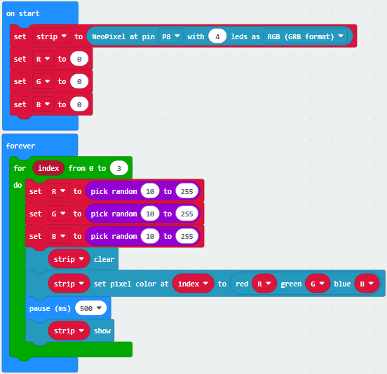  |
|--------------------------------------------------|
|                                                  |

Click“JavaScript" to switch into the corresponding JavaScript code:

**4.Test Results：**

Download code 1 to micro：bit, and dial POWER to ON end. WS2812RGB LEDs light up
different colors cyclically.

Download code 2 to micro：bit, WS2812RGB LEDs display like flow light.

Download code 3 to micro：bit, every WS2812RGB light shows random color one by
one.

([How to download?](##A01) [How to quick download?](##_7.3.快速下载))

### 16: Motor Driving

1.  **Description：**

Keyestudio micro：bit smart car is equipped with two DC geared motors which are
added a gearbox based on regular DC motors.

Gear motor is the integration of gearmotor and motor, which is applied widely in
steel and machine industry

Micro:bit motor driver shield comes with PCA9685PW and TB6612FNG chip，to save
the IO port resource，we control the rotation direction and speed of two DC gear
motors with TB6612FNG chip.

**Note: please follow the direction of eight jumper caps inserted.**

**In this way, the rotation direction is as same as the set rotation orientation
in the code**

**The picture below is wrong inserted direction of jumper caps**

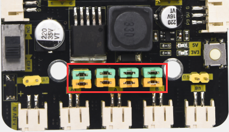

**2. Experimental Preparation：**

(1) Insert micro:bit board into slot of V2 shield.

(2) Place batteries into battery holder.

(3) Dial power switch to ON end

(4) Connect micro:bit to computer by USB cable and open online Makecode editor.

Import Hex profile [**(How to import?)** ](##_7.6.导入代码), or click“New
Project”and drag blocks step by step(add turtle-bit extension library first)

[**(How to add turtle-bit extension?)**](##M11)

**3. Test Code：**

**Code 1：**

| Type     | Route                                                     | File Name            |
|----------|-----------------------------------------------------------|----------------------|
| Hex file | ../Makecode Tutorial/Test Code/8.16: Motor Driving/Code-1 |  microbit-Code-1.hex |

Or you could edit code step by step in the editing area.

1.  Click“Led”→“more”→ “led enable fasle”

Leave it into“on start”

Tap“false”to select“true”

1.  Click“Basic”to get block“show arrow North”

Leave it into“forever”block

Click North to select South

1.  Click “TurtleBit”to drag“car Run_forward speed : 0 %”block

Place it into“forever”block

Change 0 into 100.

1.  Tap“Basic”to move“pause (ms) 100”block into“forever”block

Delay in 100ms

1.  Replicate code stringonce and
    leave it under “pause (ms) 100”block

Change South into North and Run_forward into Run_back

1.  Copy“show arrow South”once and keep it under block“pause (ms) 100”.

2.  Change South into East.

1.  Click“TurtleBit”to move“LeftSide motor run Forward speed : 0 %”and copy it
    once

2.  Place them under“show arrow East”block

3.  And copy“pause (ms) 1000”block once

4.  Set the code string as follows:

1.  Duplicate code string once
    and keep it under“pause (ms) 1000”block

Change East into West, 50 into 100 and 100 into 50

1.  Copy code string twice,

Place them into“forever”block

Click South to select East and West

Tap Run_forward to select Turn_Left and Turn_Right

1.  Tap“Basic”to drag block“show leds”into“forever”

Tick blue boxes to generate“❤”pattern

1.  Tap“TurtleBit”to drag“car stop”into“forever”block

Copy“pause (ms) 1000”once and leave it under“car stop” block

Complete Code:

|  |
|-------------------------------------------------------------------------------------------------|
|                                                                                                 |

Click“JavaScript" to switch into the corresponding JavaScript code:

**Code 2：**

| Type     | Route                                                     | File Name            |
|----------|-----------------------------------------------------------|----------------------|
| Hex file | ../Makecode Tutorial/Test Code/8.16：Motor Driving/Code-2 |  microbit-Code-2.hex |

Or you could edit code step by step in the editing area.

1.  Click“Led”→“more”→“led enable false”,

Put it into block“on start”，click drop-down triangle button to select“true”
.

1.  Click“Variables”→“Make a Variable...”

Input “a” and click“OK”, variable “a” is built

Then create the variable “b” in same way

Drag“set b to 0”into“on start” block, change b into a

Copy“set b to 0”once and leave it under“set a to 0”

1.  Click“Input”to drag out“on button A pressed”

Tap“Variables” to move“change b by 1”into“on button A pressed”block, and change
b into a.

1.  Copy code stringonce,
    delete“change a by 1”block

Change A into B

Tap“Variables”to drag“set b to 0”into“on button B pressed”

Alter 0 into 1

1.  Click“Logic” to move“if true then...”into“forever”block

Drag“=”block into“true”box

Tap“Variables”to move variable“a”to left box of “=”, and change 0 into 1.

1.  Click“Basic”to drag“show leds”under then block

    Tick blue box to generate “L”

    

2.  Click“Logic”to get“if true then...”block

Leave it under block “if..then” block

Go to“Variables”to move block“b”to left box of “=”block

Change 0 into 1

1.  Click“Basic”to get block“pause (ms) 100”

Leave it into “if..then” block

Click“TurtleBit”to move“car Run_forward speed: 0 %”under block“pause (ms)
100”and change 0 into 100

Copy“pause (ms) 1000”block and leave it under “car...100%” block.

1.  Copyonce and leave it
    under“pause (ms) 100”block

Change Run_Forward into Turn_Left, 100 into 50 and delay in 600ms

1.  Duplicate code stringonce,
    keep it under “pause (ms) 600”block

    

1.  Tap “TurtleBit”to drag“car stop”block under block“pause (ms) 1000”

Tap“Variables”to move“set b to 0”block under “car stop” block

1.  Click“Logic”to drag“if true then...”into“forever”

Move“=”block into“true”box

Click“Variables”to move“a”to left box of “=”and change 0 into 20

1.  Click“Basic”to drag“show leds”into the third “if..then” block

Tick blue boxes to produce“口”

1.  Go to“Logic”to drag“if true then...”block

Keep it under“show leds 口” block

Move variable b into left box of “=” block and change 0 into 1

1.  Tap“Basic”to drag“pause (ms) 100”and copy it once

Set to 1000ms

Tap“TurtleBit”block to drag out“car Run_forward speed: 0 %”block

Change 0 into 100

Then set the code string as follows:

1.  Duplicate code string once

Change Run_Forward into Turn_Left, 100 into 50 and 1000 into 600

Place it into code sting, as shown below

1.  Replicate code string  twice
    and keep them in the code string as follows:

    

（18）Copy code stringonce, and
leave it under “ pause(as) 600” block

1.  Copy“if a=2 then”block once and change 2 into 3

Tap “Variables”to move“set b to 0”into “if a=3 then”block

Alter b into a and 0 into 1

Complete Code:

|  |
|-------------------------------------------------|
|                                                 |

|  |
|--------------------------------------------------------------------------------------------------|
|                                                                                                  |

Click“JavaScript" to view the corresponding JavaScript code:

**4.Test Results：**

Download code 1 to micro:bit board, dial POWER switch to ON end. Smart car goes
forward for 1s, backward for 1s, turns left for 1s, turns right for 1s, rotates
anticlockwise for 1s, clockwise for 1 and stops for 1s. And dot matrix displays
the corresponding patterns

Download code 2 to micro:bit board, “L”will be shown on dot matrix when A button
is pressed, then press B, the route of smart car is “L”type.

“口”will be displayed when the Button A is pressed again, then press B, the
route of smart car is “口”type.

([How to download?](##A01) [How to quick download?](##_7.3.快速下载))

### 17: Line Tracking Smart Car

**8.17.1: Detect Line Tracking Sensor**

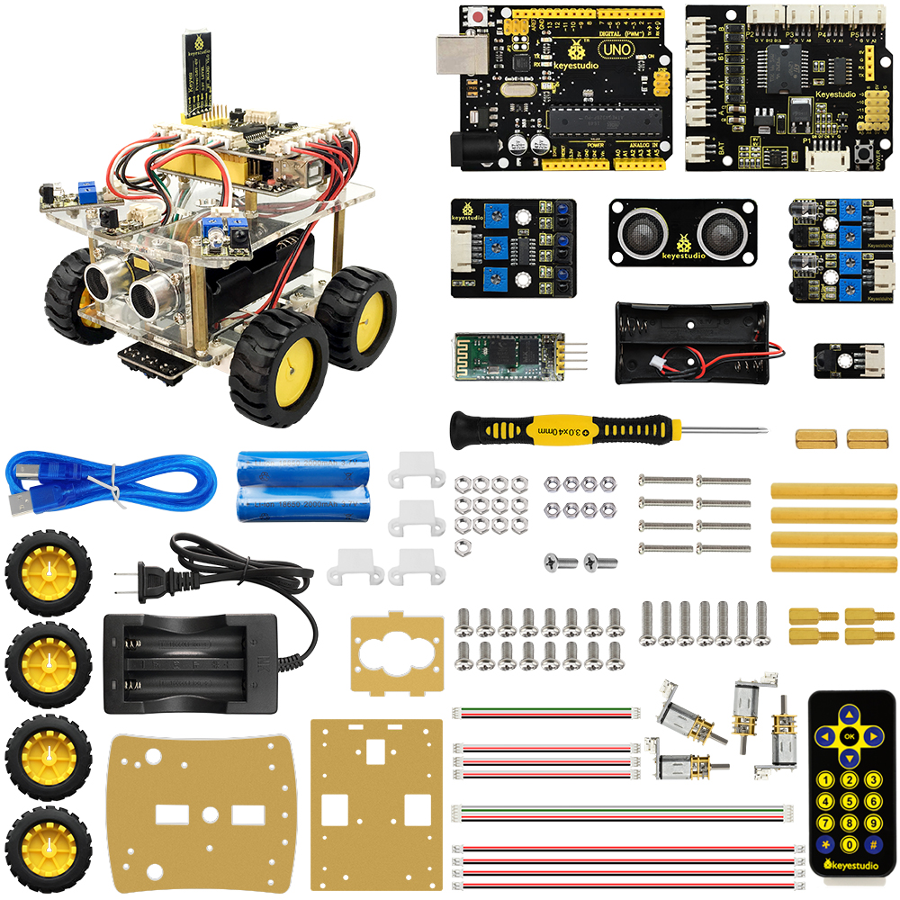

**1. Description：**

The V2 expansion board of keyestudio micro：bit mini smart robot car comes with
two line tracking sensors which adopt TCRT5000 IR tubes.

TCRT5000 IR tube has an IR emitting tube and a receiving tube.

Low level(0) is output when IR transmitting tube emits IR signals to receiving
tube; high level(1) will be output when smart car runs along black line.

When smart car drives on the white ground, TCRT5000 IR tube will emit IR signals
which will be reflected by white ground and received by receiving tube,
consequently output low level(0); on the contrary, when driving on the black
surface, the high level is output.

The left and right line tracking sensors are respectively controlled by P12 and
P13.

Put a paper under the bottom of car, adjust the potentiometers on shield to
adjust sensitivity. When D2 and D6 are on, then pull up the universal wheels for
0.5cm off the paper. The sensitivity is set well if D2 and D6 are off

**2. Experimental Preparation：**

(1) Insert micro:bit board into slot of V2 shield.

(2) Place batteries into battery holder.

(3) Dial power switch to ON end

(4) Connect micro:bit to computer by USB cable and open online Makecode editor.

(5) Import Hex profile [**(How to import?)** ](##_7.6.导入代码), or click“New
Project”and drag blocks step by step(add turtle-bit extension library first)

[**(How to add turtle-bit extension?)**](##M11)

**3. Test Code：**

**Code 1：**

| Type     | Route                                                                                                  | File Name            |
|----------|--------------------------------------------------------------------------------------------------------|----------------------|
| Hex file | ../Makecode Tutorial/Test Code/8.17: Line Tracking Smart Car/8.17.1:Detect Line Tracking Sensor/Code-1 |  microbit-Code-1.hex |

Or you could edit code step by step in the editing area.

1.  Click“Advanced”→“Serial”→“serial redirect to USB”

Place it into“on start”

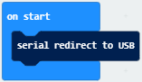

1.  Enter“Advanced”→“Serial”→“serial write value“x”=0”

Leave it into“forever”block.

Go to“Pins”→“digital read pin P0 ”

Move“digital read pin P0”into 0 box

The right tracking sensor is controlled by P14. Then change P0 into P14
and“x”into“digital signal”.

1.  Go to“Basic”→“pause (ms) 100”

Keep it into“forever”block and set to 200ms.

Complete Program：

|   |
|--------------------------------------------------|
|                                                  |

Click“JavaScript" to view the corresponding JavaScript code:

Download code 1 to micro:bit board, don’t plug off USB cable and
click

([How to quick download?](##_7.3.快速下载))

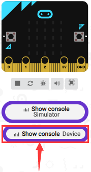

Serial monitor will display low level(0) and left indicator will be on when the
left TCRT5000 IR tube detects white objects, black objects or no object are
detected by left TCRT5000 IR tube, 1(high level) will be shown on serial monitor
and indicator will be off, as shown below:

Open CoolTerm, click Options to select SerialPort. Set COM port and 115200 baud
rate. Click“OK”and“Connect”.

The CoolTerm serial monitor displays the digital signals read by right line
tracking sensor.

**Code 2：**

| Type     | Route                                                                                                  | File Name            |
|----------|--------------------------------------------------------------------------------------------------------|----------------------|
| Hex file | ../Makecode Tutorial/Test Code/8.17: Line Tracking Smart Car/8.17.1:Detect Line Tracking Sensor/Code-2 |  microbit-Code-2.hex |

1.  Click“Led”→“more”→“led enable false”,

Put it into block“on start”，click drop-down triangle button to select“true”

\*\*\*\*\*\*\*\*\*\*\*\*\*\*\*\*\*\*\*\*\*\*\*\*\*\*\*\*\*\*\*\*\*\*\*\*\*\*\*\*\*\*\*\*\*\*\*\*\*\*\*\*\*\*\*\*\*\*\*\*\*\*\*\*\*\*\*\*\*\*\*\*\*\*\*\*\*

1.  Go to“Variables” →“Make a Variable...”→ “New variable name：” dialog box.

Enter LL and click“OK”to create variable“LL”.

Next to produce variable“RR”in same way.

Drag block“set RR to 0”into“on start”block and copy it once. Then set code
string:

1.  Click“Variables”to drag block“set RR to 0”into block“forever”

Tap RR to select LL

Tap“Advanced”→“Pins”→“digital read pin P0”

Place“digital read pin P0”into 0 box

Copy“set LL to digital read pin P0”twice and keep them into “forever” block.

Separately change into CC and RR

The three TCRT5000 IR tubes of line tracking sensor are controlled by P14, P15
and P16, therefore we set to code string as follows:

1.  Click“Logic” to drag“if true then...else”block into“forever”block

Tap“”for six times and
move“and”block twice and place them into true boxes, as shown below:

1.  Go to“Logic”to move block“=”into left box of the first and block

Click“Variables”to drag“LL”into left box of “=”block

Copy“LL=0”twice and respectively leave them into boxes of the second and block
and change 0 into 1, as shown below

1.  Click“Basic”to move block“show leds”under “if....then” block

Copy it twice and respectively leave them under the first and second “else
if....then” block

Replicate“LL=0 and CC=1 and RR=1”twice and edit code string as follows:

1.  Duplicate“LL=1 and CC=1 and RR=0”again and leave it into box behind the
    third else if block

Set“LL=0 and CC=0 and RR=1”

1.  Click“Basic”to move block“show icon”under the fourth“else if...then” block

Click the triangle button to
select“”

1.  Copy“LL=0 and CC=0 and RR=1”for three times and block“show icon” for four
    times

1.  Edit the code string as follows:

Complete Code：

| ” When the above condition is not met, execute the program under else block Micro:bit shows“❤”   |
|---------------------------------------------------------------------------------------------------------------------------------------------------------------------------------------------------------------------------------------------------------------------------------------------------------------------------------------------------------------------------------------------------------------------------------------------------------------------------------------------------------------------------------------------------------------------------------------------------------------------------------------------------------------------------------------------------------------------------------------------------------------------------------------------------------------------------------------------------------------------------------------------------------------------------------------------------------------------------------------------------------------------------------------------------------------------------------------------------------------------------------------------------------------------------------------------------------------------------------------------------------------------------------------------------------------------------------------------------------------------------------------------------------------------------------------------------------------------------------------------------------------------------------------------------------------------------------------------------------------------------------------------------------------------------------------------------------------------------------------------------------------------------------------------------------------------------------------------------------------------------|
|                                                                                                                                                                                                                                                                                                                                                                                                                                                                                                                                                                                                                                                                                                                                                                                                                                                                                                                                                                                                                                                                                                                                                                                                                                                                                                                                                                                                                                                                                                                                                                                                                                                                                                                                                                                                                                                                           |

Click“JavaScript" to switch into the corresponding JavaScript code:

**Code 3：**

We could use block“”to simplify
code 2. The digital signal read by line tracking sensor is 0(low level) and
1(high level).

Then we transfer the digital signals from line tracking sensor into binary and
decimal system, as shown below:

|  Level of left, middle and right TCRT5000 IR Tube |  Binary   | Decimal system |     |   |
|---------------------------------------------------|-----------|----------------|-----|---|
| Low（0）                                          | Low（0）  | High（1）      | 001 | 1 |
| Low（0）                                          | High（1） | Low（0）       | 010 | 2 |
| Low（0）                                          | High（1） | High（1）      | 011 | 3 |
| High（1）                                         | Low（0）  | Low（0）       | 100 | 4 |
| High（1）                                         | Low（0）  | High（1）      | 101 | 5 |
| High（1）                                         | High（1） | Low（0）       | 110 | 6 |
| High（1）                                         | High（1） | High（1）      | 111 | 7 |
| Low（0）                                          | Low（0）  | Low（0）       | 000 | 0 |

| Type     | Route                                                                                                   | File Name            |
|----------|---------------------------------------------------------------------------------------------------------|----------------------|
| Hex file | ../Makecode Tutorial/Test Code/8.17：Line Tracking Smart Car/8.17.1：Detect Line Tracking Sensor/Code-3 |  microbit-Code-3.hex |

Or you could edit code step by step in the editing area.

1.  Click“Advanced” →“Serial”→“serial redirect to USB”

Place it into“on start”block.

(2) Click“Variables”→“Make a Variable...”→“New variable name：”dialog box;

Input val and click“OK”to generate variable“val”

Move out“set val to 0”and keep it into block“on start”

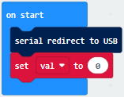

(3) Enter“Variables” →“set val to 0”

Keep it into “forever” block

Move“Line Tracking”from“TurtleBit”and place it into 0 box

(4) Click“Advanced”→“Serial”→“serial write value“x”=0”

Put it into“forever”，and move variable “val”into 0 box.

\*\*\*\*\*\*\*\*\*\*\*\*\*\*\*\*\*\*\*\*\*\*\*\*\*\*\*\*\*\*\*\*\*\*\*\*\*\*\*\*\*\*\*\*\*\*\*\*\*\*\*\*\*\*\*\*\*\*\*\*\*\*\*\*\*\*\*\*\*\*\*\*\*\*\*\*\*

1.  Click“Logic”→“if true then...else”

Move it into“forever” , tap“” six
times and move out “=” block into “true” block.

(6) Enter“Variables”to move block“val”into left box of“=”block

And change 0 into 3.

(7) Enter“Basic” → “show leds”

Place it under the first block“if..val...then”block

Tick dark blue boxes to generate“I”pattern.

(8) Copy block“val=3 ”once and place it into box behind the first “else of ...
then” block and change 3 into 5

(9) Replicate “show leds”block and leave it under the first “else of ...
then”block.

Tick blue boxes to produce“I”

1.  Duplicate block“val=5 ”and place it into the second box behind the second
    “else if...then” block, change 5 into 6

    

2.  Duplicate“show leds”once and leave it into box behind the second“else
    if...then”block

Tick blue box to create“I”

1.  Copy“val=6”block once and leave it into box behind the third“else
    if...then”block

Change 6 into 1

1.  Drag out“show icon”under the third“else if...then”block

Click “❤”to set“”

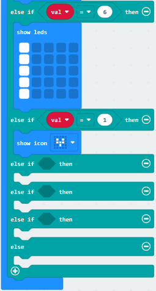

1.  Copy“val=1”once and leave it into box behind the the fourth “else if ..then”
    block.

Change 1 into 2.

1.  Copy block“show icon”for four times and click the triangle button to select
    “”.

Set to val=1, 2, 4 and 7

Complete Code

| ” When the above condition is not met, execute the program under else block Micro:bit shows“❤” |
|--------------------------------------------------------------------------------------------------------------------------------------------------------------------------------------------------------------------------------------------------------------------------------------------------------------------------------------------------------------------------------------------------------------------------------------------------------------------------------------------------------------------------------------------------------------------------------------------------------------------------------------------------------------------------------------------------------------------------------------------------------------------------------------------------------------------------------------------------------------------------------------------------------------------------------------------------------------------------------------------------------------------------------------------------------------------------------------------------------------------------------------------------------------------------------------------------------------------------------------------------------------------------------------------------------------------------------------------------------------------------------------------------------------------------------------------------------------------------------------------------------------------------------------------------------------------------------------------------------------------------|
|                                                                                                                                                                                                                                                                                                                                                                                                                                                                                                                                                                                                                                                                                                                                                                                                                                                                                                                                                                                                                                                                                                                                                                                                                                                                                                                                                                                                                                                                                                                                                                                                                          |

Click“JavaScript" to switch into the corresponding JavaScript code:

**3.Test Results：**

Download code 2 to micro:bit board,“I”will be shown at left and indicator will
be on when only left TCRT5000 IR tube on line tracking sensor detects white
objects.

“I”will be shown in the middle and indicator will be on when only middle
TCRT5000 IR tube on line tracking sensor detects white objects.

“I”will be shown at right and indicator will be on when only right TCRT5000 IR
tube on line tracking sensor detects white objects.

As only left and middle TCRT5000 IR tubes detect white objects, micro:bit
shows“”and indicators at left and
middle are on.

Micro:bit shows“”and indicators
at left and right are on when only left and right TCRT5000 IR tubes detect white
objects.

Micro:bit shows“”and indicators
at right and middle are on when only middle and right TCRT5000 IR tubes detect
white objects.

Micro:bit displays“”and none of
indicator is on when both of them detect black objects or no object is detected.

Both of them detect white objects, micro:bit shows“❤”and indicators are on.

([How to download?](##A01) [How to quick download?](##_7.3.快速下载))

Download code 3 to micro:bit, and keep micro：bit connected and
click

([How to quick download?](##_7.3.快速下载))

Number 3 will be displayed when only left TCRT5000 IR tube detects white
objects.

Number 5 will be displayed when only middle TCRT5000 IR tube detects white
objects.

Number 6 will be displayed when only right TCRT5000 IR tube detects white
objects.

Number 1 will be displayed when only left and middle TCRT5000 IR tubes detect
white objects.

Number 2 will be displayed when only left and right TCRT5000 IR tubes detect
white objects.

Number 4 will be displayed when only right and middle TCRT5000 IR tubes detect
white objects.

Number 7 will be displayed when all TCRT5000 IR tubes detect black objects or
not object is detected.

Open CoolTerm, click Options to select SerialPort. Set COM port and 115200 baud
rate(the baud rate of USB serial communication of Micro:bit is 115200 through
the test). Click“OK”and“Connect”，

CoolTerm serial monitor display the value of decimal system.

**8.17.2: Line Tracking Smart Car**

**1.Description：**

In this lesson we will combine line tracking sensors with a motor to make a line
tracking smart car.

The micro:bit board will analyze the signals and control smart car to show line
tracking function.

| Left/Middle/Right TCRT5000  IR Tunes（Level） | binary    | Decimal system (a) | Turtle Smart Car |   |            |
|-----------------------------------------------|-----------|--------------------|------------------|---|------------|
| LOW （0）                                     | LOW （0） | HIGH（1）          | 001              | 1 | Turn Right |
| LOW （0）                                     | HIGH（1） | LOW （0）          | 010              | 2 | Go forward |
| LOW （0）                                     | HIGH（1） | HIGH（1）          | 011              | 3 | Go forward |
| HIGH（1）                                     | LOW （0） | LOW （0）          | 100              | 4 | Turn Left  |
| HIGH（1）                                     | LOW （0） | HIGH（1）          | 101              | 5 | Go forward |
| HIGH（1）                                     | HIGH（1） | LOW （0）          | 110              | 6 | Go forward |
| HIGH（1）                                     | HIGH（1） | HIGH（1）          | 111              | 7 | Go forward |
| LOW （0）                                     | LOW （0） | LOW （0）          | 000              | 0 | Stop       |

The three-channel line tracking sensor is connected to integrated pin(G,5V P14,
P15, P16) and controlled by P14, P15 and P16.

**2. Experimental Preparation：**

1.  Insert micro:bit board into slot of V2 shield.

2.  Place batteries into battery holder.

3.  Dial power switch to ON end

4.  Connect micro:bit to computer by USB cable and open online Makecode editor.

Warning: the line tracking sensor can't work normally under strong light because
there is a mountain of invisible light including IR and ultraviolet rays.

**3. Flow Chart**

**4. Test Code：**

| Type     | Route                                                                      | File Name                            |
|----------|----------------------------------------------------------------------------|--------------------------------------|
| Hex file | ../Test Code/8.17：Line Tracking Smart Car/8.17.2：Line Tracking Smart Car | microbit-Line Tracking Smart Car.hex |

Or you could edit code step by step in the editing area.

1.  Enter“Basic”→“show icon ♥”

Combine it with“on start” block，and click triangle button to select
“”.

1.  Click “Neopixel” →“set strip to Neopixel at pin P0 with 24 leds as RGB (GRB
    format)”

Put it into“on start”block，P8 of 4pcs WS2812RGB lights is connected by P8 of
micro:bit.

Click the triangle button to set to P8 and set to 4 leads

1.  Enter“Neopixel”→“strip clear”

Place it into“on start”

1.  Go to“Variables”→“Make a Variable...”→“New variable name：”

Enter“tracking values”and click“OK”, then variable“tracking values”is set up.

Drag“set tracking values to 0”into forever block.

Tap turtle-bit to move“Line Tracking”block into 0 box.

1.  Click“Logic”and drag“if true then...else”under the block“set...tracking”.

Tap“”twice, move“or”block into
true box, then copy “or” block for three times and leave them into right box
of“or”block.

1.  Tap“Logic”to drag out“=”and leave it at left box of“or”block

Click“Variables”to move“tracking values” into right box of“=”block.

Change 0 into 2

Copy“tracking values=2”for four times, and separately leave them into boxes as
follows:

Change 2 into 3, 5, 6 and 7

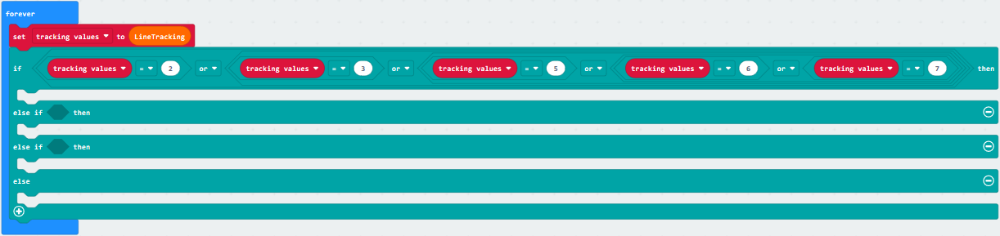

1.  Click“TurtleBit” to drag“car Run_forward speed: 0 %”under “if....then” block

Change 0 into 60

Tap“Neopixel”to get block“strip show color red”

Change red into green

Leave“strip show color green”under “car....68%”block

1.  Duplicate block“tracking values=2”once and place it into box behind the
    first“else if”block, change 2 into 4.

1.  Click“TurtleBit”to drag“LeftSide motor run Forward speed: 0 %”

Copy it once and leave them under the“else if....then”block

Then set blocks as follows:

Copy“strip show color green”once and change green into blue.

1.  Copy“tracking values=4”once and place it into box behind the second “else
    if”, change 4 into 1.

1.  Copy once,and place it under
    the “second else if..then”block

Set the code string as follows:

1.  Click“TurtleBit”to move“car stop”under the else block

Copy“strip show color yellow”once and alter yellow into red.

Place blocks as follows:

Complete Code

”

Set strip to Neopixel pin 8 with 4 leads(RGB format)

Turn off all RGB on strip

The program under the block“forever”runs cyclically.

Set tracking values to the value read by line tracking sensor

When tracking values=2, 3, 5, 6 or 7, execute the program under then block

Go forward at the 60% speed

4pcs WS2812RGB display green color

When tracking values=4, execute the program under then block.

The left car wheels go back at 80% speed

The right car wheels go forward at 80% speed

4pcs WS2812RGB display blue color

When tracking values=1, execute the program under then block

The left car wheels go backward at 80% speed

The right car wheels go backward at 80% speed

4pcs WS2812RGB display yellow color

When tracking values is not met, execute the program under else block

turtle car stops

4pcs WS2812RGB display red color

“on start”: command block runs once to start program.

Micro:bit shows“”

Set strip to Neopixel pin 8 with 4 leads(RGB format)

Turn off all RGB on strip

The program under the block“forever”runs cyclically.

Set tracking values to the value read by line tracking sensor

When tracking values=2, 3, 5, 6 or 7, execute the program under then block

Go forward at the 60% speed

4pcs WS2812RGB display green color

When tracking values=4, execute the program under then block.

The left car wheels go back at 80% speed

The right car wheels go forward at 80% speed

4pcs WS2812RGB display blue color

When tracking values=1, execute the program under then block

The left car wheels go backward at 80% speed

The right car wheels go backward at 80% speed

4pcs WS2812RGB display yellow color

When tracking values is not met, execute the program under else block

turtle car stops

4pcs WS2812RGB display red color

Click“JavaScript"to view the corresponding JavaScript code:

**6. Test Results：**

Download code to micro:bit and dial POWER to ON end, line tacking car goes
forward along black line and turn on WS2812 RGB lights

([How to download?](##A01) [How to quick download?](##_7.3.快速下载))

Note: turn on the switch at the back of micro:bit car.

the width of black line should be larger than the width of line tracking sensor.

Avoid to test smart car under the strong light.

### 18: Ultrasonic Follow Smart Car

#### 18.1: Ultrasonic Ranging

**1. Description：**

The HC-SR04 ultrasonic sensor uses sonar to determine distance to an object like
bats do. It offers excellent non-contact range detection with high accuracy and
stable readings in an easy-to-use package. It comes complete with ultrasonic
transmitter and receiver modules.

The HC-SR04 or the ultrasonic sensor is being used in a wide range of
electronics projects for creating obstacle detection and distance measuring
application as well as various other applications.

As the above picture shown, it is like two eyes. One is transmitting end, the
other is receiving end.

The ultrasonic module will emit the ultrasonic waves after trigger signal. When
the ultrasonic waves encounter the object and are reflected back, the module
outputs an echo signal, so it can determine the distance of object from the time
difference between trigger signal and echo signal.

**2.Working Principle：**

1.  Pull down TRIG then trigger high level signals with least 10us

2.  After triggering, the module will automatically send eight 40KHz ultrasonic
    pulses and detect whether there is a signal return.

3.  The propagation speed of sound in the air is about 343m/s, therefore,
    distance = speed \* time, because the ultrasonic wave emits and comes back,
    which is 2 times of distance, so it needs to be divided by 2, the distance
    measured by ultrasonic wave = (speed \* time)/2

**3. Specifications：**

-   Working voltage：3-5.5V（DC）

-   Power Supply :+5V DC

-   Working Current: 15mA

-   Working frequency: 40khz

-   Maximum Ranging Distance : around 3m

-   Minimum Ranging Distance: 2-3cm

-   Resolution : 0.3 cm

-   Measuring Angle: ≤15 degree

-   Trigger Input Pulse width: 10uS

-   Accuracy: up to 0.2cm

-   Output echo signal : output TTL level signal(high), which is proportion to
    range.

**4.Experimental Preparation：**

Insert micro:bit board into slot of V2 shield.

Place batteries into battery holder.

Dial power switch to ON end

Connect micro:bit to computer by USB cable and open online Makecode editor.

Import Hex profile [**(How to import?)** ](##_7.6.导入代码), or click“New
Project”and drag blocks step by step(add turtle-bit extension library first)

[**(How to add turtle-bit extension?)**](##M11)

**5.Test Code：**

| Type     | Route                                                                                       | File Name                       |
|----------|---------------------------------------------------------------------------------------------|---------------------------------|
| Hex file | ../Makecode Tutorial/Test Code/8.18: Ultrasonic Follow Smart Car/8.18.1: Ultrasonic Ranging | microbit-Ultrasonic Ranging.hex |

Or you could edit code step by step in the editing area.

1.  Tap“Advanced”→“Serial” →“serial redirect to USB”

Combine it with“on start”block

\*\*\*\*\*\*\*\*\*\*\*\*\*\*\*\*\*\*\*\*\*\*\*\*\*\*\*\*\*\*\*\*\*\*\*\*\*\*\*\*\*\*\*\*\*\*\*\*\*\*\*\*\*\*\*\*\*\*\*\*\*\*\*\*\*\*\*\*\*\*\*\*\*\*\*\*\*

1.  Go to “Variables”→“Make a Variable...”→“New variable name：” dialog box，

Input i and click“OK”to produce variable“i”，

Move“set i to 0”from“Variables”and integrate with“on start”block

\*\*\*\*\*\*\*\*\*\*\*\*\*\*\*\*\*\*\*\*\*\*\*\*\*\*\*\*\*\*\*\*\*\*\*\*\*\*\*\*\*\*\*\*\*\*\*\*\*\*\*\*\*\*\*\*\*\*\*\*\*\*\*\*\*\*\*\*\*\*\*\*\*\*\*\*\*

1.  Tap“Advanced”→“Serial” →“serial write value x=0”

Place it under“set i to 0”block

Click“TurtleBit”to move“Ultrasonic”into 0 box of “=” block

Change X into distance

1.  Click“Logic”to drag“if true then”block into“forever”block.

Move“=”into true box

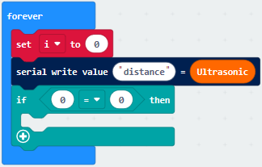

1.  Click“TurtleBit”to drag“Ultrasonic”to left box of “=”

Change “=” into “\<”, 0 into 10.

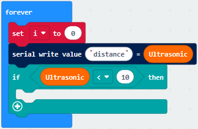

1.  Tap“Loops”to get block“while true do”and place it into forever block

    Click“Logic”to move “=” block into true box

1.  Click“Variables”to move variable“i”to left box of “=” block

Change“=” into “\<”and 0 into 1

1.  Click“Music”and move“play tone Middle C for 1 beat”block into do block

Tap“Basic”to move“pause(ms)100”under “play...beat” block

Change 100 into 200

Copy once and place it into do
block

Click“Variables”to drag“change i by 1”into do block

Complete Code

|   |
|--------------------------------------------------|
|                                                  |

Click“JavaScript" to view the corresponding JavaScript code:

**6.Test Results：**

Download code to micro:bit, keep USB cable connected, dial POWER switch to ON
end. The distance value will be displayed on monitor.

([How to quick download?](##_7.3.快速下载))

The monitor shows the distance between the obstacle and ultrasonic sensor(as
shown below). When the distance is less than 10cm, the passive buzzer of smart
car emits sound.

Open CoolTerm, click Options to select SerialPort. Set COM port and 115200 baud
rate(the baud rate of USB serial communication of Micro:bit is 115200 through
the test). Click “OK” and “Connect”.

CoolTerm serial monitor displays the distance value as follows:

#### 18.2: Ultrasonic Avoidance Car

**1. Description：**

We’ve learned the knowledge of obstacle avoidance sensor. In this project, we
will integrate ultrasonic sensor, and car expansion board to make an ultrasonic
avoidance car.

Its principle is to detect the distance between the car and obstacle by
ultrasonic sensor and control the motion of smart car.

**2. Experimental Preparation：**

1.  Insert micro:bit board into slot of V2 shield.

2.  Place batteries into battery holder.

3.  Dial power switch to ON end

4.  Connect micro:bit to computer by USB cable and open online Makecode editor.

5.  Import Hex profile [**(How to import?)** ](##_7.6.导入代码), or click“New
    Project”and drag blocks step by step(add turtle-bit extension library first)

[**(How to add turtle-bit extension?)**](##M11)

**3.Flow Chart**

**4.Test Code：**

| Type     | Route                                                                                             | File Name                             |
|----------|---------------------------------------------------------------------------------------------------|---------------------------------------|
| Hex file | ../Makecode Tutorial/Test Code/8.12: Ultrasonic Follow Smart Car/8.12.2：Ultrasonic Avoidance Car | microbit-Ultrasonic Avoidance Car.hex |

Or you could edit code step by step in the editing area.

1.  Enter“Basic” →“show icon ♥”

Place it into“on start”and click the triangle button to
select“” pattern.

1.  Click“TurtleBit”to move“LED brightness 0”into“on start”block

Change 0 into 200

1.  Tap“Variables”→“Make a Variable...”

Put“distance”in the search bar

Click“OK”to set up variable“distance”

Place it under“LED brightness 2000”block

1.  Go to“Logic”to move“if true then...else”under “set...ultrasonic”block

Drag“=”block into true box

Click“Variables”to move variable“distance”into left box of“=”block

Change“=”into“＞”, 0 into 15.

1.  Tap“TurtleBit”to move“car Run_forward speed: 0%”block under “if...then”
    block

Change 0 into 80

Drag“set left_side RGBled red”and place it under“car...80%” block

Copy it once and change red into green

Set code string as follows

1.  Click“TurtleBit”to drag“LeftSide motor run forward speed: 0%”block into else
    block

Chang“forward”into back,0 into 60

Copy“LeftSide motor run back speed: 60%”again

Set the code string as follows:

(7) Duplicate once and leave it
under else block

Click green to select blue

Complete Code

Click“JavaScript" to switch into the corresponding JavaScript code:

1.  **Test Results：**

Download code to micro:bit, dial to ON end, and dial POWER to ON end. When the
obstacle distance is greater than 15cm, turtle car goes forward and 2 RGB lights
show green color; on the contrary, smart car turns left and 2 RGB lights show
blue color.

([How to download?](##A01) [How to quick download?](##_7.3.快速下载))

#### 18.3: Ultrasonic Follow Smart Car

**1. Description：**

In previous lesson, we’ve learned the basic principle of line tracking sensor.
Next, we will combine ultrasonic sensor with car shield to make an ultrasonic
follow car.

The ultrasonic sensor detects the obstacle distance and control the motion
status of car.

**2. Experimental Preparation：**

1.  Insert micro:bit board into slot of V2 shield.

2.  Place batteries into battery holder.

3.  Dial power switch to ON end

4.  Connect micro:bit to computer by USB cable and open online Makecode editor.

5.  Import Hex profile [**(How to import?)** ](##_7.6.导入代码), or click“New
    Project”and drag blocks step by step(add turtle-bit extension library first)

[**(How to add turtle-bit extension?)**](##M11)

**3. Flow Chart**

**4. Test Code：**

| Type     | Route                                                                                               | File Name                                |
|----------|-----------------------------------------------------------------------------------------------------|------------------------------------------|
| Hex file | ../Makecode Tutorial/Test Code/8.18 Ultrasonic Follow Smart Car/8.18.3：Ultrasonic Follow Smart Car | microbit-Ultrasonic Follow Smart Car.hex |

Or you could edit code step by step in the editing area.

1.  Enter“Basic” →“show icon ♥”

Place it into“on start”and click the triangle button to
select“” pattern.

\*\*\*\*\*\*\*\*\*\*\*\*\*\*\*\*\*\*\*\*\*\*\*\*\*\*\*\*\*\*\*\*\*\*\*\*\*\*\*\*\*\*\*\*\*\*\*\*\*\*\*\*\*\*\*\*\*\*\*\*\*\*\*\*\*\*\*\*\*\*\*\*\*\*\*\*\*

1.  a. Enter “Neopixel” →“set strip to Neopixel at pin P0 with 24 leds as RGB
    (GRB format)”

b. Place it into“on start”block，

c. 4 pcs WS2812 RGB lights are controlled by P8 of micro:bit board . So we set
to P8 and 4 leads

(3)Tap“Neopixel”→“more”→“strip set brightness 255”

Leave it under the block “set....(RGB format)

To reduce the brightness of WS2812 RGB lights, change 255 into 100.

(4) Click“Neopixel”to find“strip clear”

Keep it into“on start”block.

(5) Go to“Variables”→“Make a Variable...”→“New variable name：” dialog box，

Input distance and click“OK”to produce variable“distance”，

Drag out“set distance to 0”into“on start”

(6) Click“Variables”to move“set distance to 0”into forever block

Click“TurtleBit”to drag block“Ultrasonic”into 0 box.

(7) Enter“Logic”to move out“if true then”into“forever”,

Then place“and”block into true box.

(8) Click“Logic”to move out“=”into left box of“and”block

Move out variable“distance”into left box of“=”block

Change“=”into“≥”and 0 into 10.

Replicate“distance≥10”once and leave it into right box of“and”block.

Then we set distance ≤30

1.  Click“TurtleBit”→“car Run_Forward speed: 0 %”

Leave it under“if...30 then”block. Then change 0 into 80.

Go to“Neopixel” →“strip show color red”

Place it under“car Run_Forward speed: 80 %”block.

1.  Duplicate code string once
    and keep it into“forever”，

Delete block“distance≥10”and“and”block，

Change 30 into 6, Run_Forward into Run_Back , 80 into 60 and red into yellow.

1.  Copy code string once and
    place it into“forever”，

Delete block“distance≤6”and“car RunBack speed: 60 %”

Go to“Logic”to drag out block“or”into true box，

Move block“and”into left box of“or”block，

Replicate block“distance≤6”once and place it into left box of“and”block，

Change“≤”into“\>”，and duplicate block “distance≥10”once and move into right box
of“and”，

Change“≥”into“\<”，and copy block“distance≤30”once and drag into right box
of“or”，

Change“≤”into“\>”，and move block“car stop”from“TurtleBit”

Keep“car stop”block under“if...then”block

Alter yellow into white.

Complete Code:

”图案。

....................③将strip设为引脚P5初始化灯带4颗LED（模式RGB（GRB顺序））

....................④设置4个WS2812 RGB亮度（PWM）为100

....................⑤Turn off all RGB on strip

....................⑥将变量distance设为0

....................⑦The program under the block“forever”runs cyclically.

....................⑧将变量distance设为超声波传感器读取的距离值。

....................⑨当10cm≤distance≤30cm成立时，执行then下的程序

....................⑩小车以80%速度前进

....................⑪strip上4个WS2812 RGB都亮红色灯

....................⑫当distance≤6cm成立时，执行then下的程序

....................⑬小车以60%速度后退

....................⑭strip上4个WS2812RGB都亮黄色灯

....................⑮当6cm\<distance\<10cm或distance\>30cm成立时，执行then下的程序

....................⑯小车停止

....................⑰strip上4个WS2812RGB都亮白色灯

....................①“on start”: command block runs once to start program.

....................②Micro:bit
shows“”图案。

....................③将strip设为引脚P5初始化灯带4颗LED（模式RGB（GRB顺序））

....................④设置4个WS2812 RGB亮度（PWM）为100

....................⑤Turn off all RGB on strip

....................⑥将变量distance设为0

....................⑦The program under the block“forever”runs cyclically.

....................⑧将变量distance设为超声波传感器读取的距离值。

....................⑨当10cm≤distance≤30cm成立时，执行then下的程序

....................⑩小车以80%速度前进

....................⑪strip上4个WS2812 RGB都亮红色灯

....................⑫当distance≤6cm成立时，执行then下的程序

....................⑬小车以60%速度后退

....................⑭strip上4个WS2812RGB都亮黄色灯

....................⑮当6cm\<distance\<10cm或distance\>30cm成立时，执行then下的程序

....................⑯小车停止

....................⑰strip上4个WS2812RGB都亮白色灯

Click“JavaScript" to switch into the corresponding JavaScript code:

**5. Test Results：**

Download code to micro:bit, dial POWER switch to ON end on shield, smart can
could follow the obstacle to move and WS2812 RGB lights show different color

Note: the obstacle only moves in front of smart car, not turning

### 19: IR Remote Control Smart Car

#### 19.1: Decode IR Remote Control

**1. Description：**

There is no doubt that infrared remote control is ubiquitous in daily life. It
is used to control various household appliances, such as TVs, stereos, video
recorders and satellite signal receivers. Infrared remote control is composed of
infrared transmitting and infrared receiving systems, that is, an infrared
remote control and infrared receiving module and a single-chip microcomputer
capable of decoding.​

The 38K infrared carrier signal emitted by remote controller is encoded by the
encoding chip in the remote controller. It is composed of a section of pilot
code, user code, user inverse code, data code, and data inverse code. The time
interval of the pulse is used to distinguish whether it is a 0 or 1 signal and
the encoding is made up of these 0, 1 signals.

The user code of the same remote control is unchanged. The data code can
distinguish the key.

When the remote control button is pressed, the remote control sends out an
infrared carrier signal. When the IR receiver receives the signal, the program
will decode the carrier signal and determines which key is pressed. The MCU
decodes the received 01 signal, thereby judging what key is pressed by the
remote control.  
Infrared receiver we use is an infrared receiver module. Mainly composed of an
infrared receiver head, it is a device that integrates reception, amplification,
and demodulation. Its internal IC has completed demodulation, and can achieve
from infrared reception to output and be compatible with TTL signals.
Additionally, it is suitable for infrared remote control and infrared data
transmission. The infrared receiving module made by the receiver has only three
pins, signal line, VCC and GND.

**2. Specifications：**

-   Operating Voltage: 3.3-5V（DC）

-   Interface: 3PIN

-   Output Signal: Digital signal

-   Receiving Angle: 90 degrees

-   Frequency: 38khz

-   Receiving Distance: about 5m

**3. Experimental Preparation：**

1.  Insert micro:bit board into slot of V2 shield.

2.  Place batteries into battery holder.

3.  Dial power switch to ON end

4.  Connect micro:bit to computer by USB cable and open online Makecode editor.

5.  Import Hex profile [**(How to import?)** ](##_7.6.导入代码), or click“New
    Project”and drag blocks step by step(add turtle-bit extension library first)

[**(How to add turtle-bit extension?)**](##M11)

**4. Test Code：**

| Type     | Route                                                                                             | File Name                             |
|----------|---------------------------------------------------------------------------------------------------|---------------------------------------|
| Hex file | ../Makecode Tutorial/Test Code/8.19：IR Remote Control Smart Car/8.19.1：Decode IR Remote Control | microbit-Decode IR Remote Control.hex |

1.  Click“Advanced”→“Serial”→“serial redirect to USB”

Place it into“on start”block.

1.  Enter“IrRemote”→“connect IR receiver at P0”

Put it into“on start”block

IR receiving module is controlled by P11 of micro:bit board, so click P0 to
select P11.

1.  Go to“Variables”→“Make a Variable...”→ “New variable name：” dialog box，

Enter“val”and click“OK”to create variable“val”

Then drag out“set val to 0”block into“forever”block.

1.  Go to“Ir Remote”→“IR button”

Place it into 0 box

1.  Click“Advanced”→“Serial”→“serial write value“x”=0”

Put it into“forever”block

Change“x”into“IR”

Enter“Variables”to move block“val”into 0 box behind“=”

1.  Drag out block“pause (ms) 100”from“Basic”and delay in 1000ms

Leave it into“forever”block

Complete Program：

|  |
|-------------------------------------------------|
|                                                 |

Click“JavaScript" to switch into the corresponding JavaScript code:

Code explanation: when the buttons are not pressed, the serial monitor
constantly shows 0; when pressed, the corresponding key values are displayed.

**Notes：**

The remote control in this kit is not inclusive of batteries. We recommend you
to purchase them online.(battery type:CR2025).

Make sure IR remote is good before test. There is a tip for you to check it.

Open the cellphone camera , make IR remote control point at camera and press
button. The remote control is good if you see the purple flashing light in the
camera.

Download code to micro: bit board and don’t plug off USB cable
Click

([How to quick download?](##_7.3.快速下载))

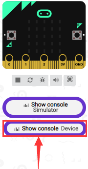

Make IR remote control point at IR receiver and press the button, the serial
monitor will display the corresponding key values, as shown below：

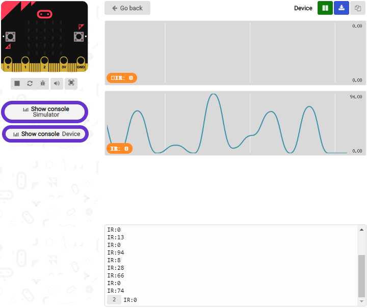

Open CoolTerm, click Options to select SerialPort. Set COM port and 115200 baud
rate. Click“OK”and“Connect”.

CoolTerm serial monitor shows the key value as follows:

The key value is displayed as for your reference:

#### 19.2: IR Remote Control

**1.Description：**

In this project, we combine IR remote control with car shield to make an IR
remote smart car. Its principle is to control the motion of car by sending key
signals from IR remote control to IR receiving module of car shield.

**2.Experimental Preparation：**

1.  Insert micro:bit board into slot of V2 shield.

2.  Place batteries into battery holder.

3.  Dial power switch to ON end

4.  Connect micro:bit to computer by USB cable and open online Makecode editor.

5.  Import Hex profile [**(How to import?)** ](##_7.6.导入代码), or click“New
    Project”and drag blocks step by step(add turtle-bit extension library first)

[**(How to add turtle-bit extension?)**](##M11)

**3.Flow Chart**

**4.Test Code:**

| Type     | Route                                                                                      | File Name                       |
|----------|--------------------------------------------------------------------------------------------|---------------------------------|
| Hex file | ../Makecode Tutorial/Test Code/8.19：IR Remote Control Smart Car/8.19.2：IR Remote Control | microbit-IR Remote Control .hex |

Or you could edit code step by step in the editing area.

1.  Enter“IrRemote”to get block“connect IR receiver at P0”

Put it into“on start”block

IR receiving module is controlled by P11 of micro:bit board, so click P0 to
select P11.

1.  a. Enter“Neopixel” →“set strip to Neopixel at pin P0 with 24 leds as RGB
    (GRB format)”

b. Place it into“on start”block，

c. Signal end of WS2812 RGB is connected to P8 of micro:bit board . So we set to
P8.

d. The robot has 4 pcs WS2812 RGB lights, therefore, change 24 into 4.

1.  Go to“Variables”→“Make a Variable...”→“New variable name：”dialog box.

Enter“val”and click“OK”to produce variable“val”

Move“set val to 0”under“set strip...RGB(RGB format)” block

Then create variable“val2”in same way

Drag“set val2 to 0”into“on start”

Edit the code as follows:

1.  Copy“set val2 to 0”once and move it into“forever”block.

Click the triangle button to select“val”

Go to“IrRemote”to drag block“IR button”into 0 box.

\*\*\*\*\*\*\*\*\*\*\*\*\*\*\*\*\*\*\*\*\*\*\*\*\*\*\*\*\*\*\*\*\*\*\*\*\*\*\*\*\*\*\*\*\*\*\*\*\*\*\*\*\*\*\*\*\*\*\*\*\*\*\*\*\*\*\*\*\*\*\*\*\*\*\*\*\*

1.  Enter“Logic”→“if true then”and place it into“forever”

Drag block“=”block into“true”box

Go to“Variables”and move“val”block into left box of“=”.

Then click“=”to set“≠”

1.  Duplicate“set val2 to 0”block again and leave it under the block
    “if...val...then”block.

Then drag out variable“val”into 0 box.

1.  Go to“Logic”to drag block“if. true..then...else”under block“set val2 to
    val”block.

Then tap“”four times and
delete“”behind“else”

Move“=”block into“true”box.

1.  Go to“Variables”to move block“val2”into left box of“=”

Change 0 into 70.

1.  Enter“TurtleBit”→“car Run_Forward speed: 0%”

Leave it under the second block“if...val2..then”block and change 0 into 90.

Go to“Neopixel”to move block“strip show color red”under block“car Run_Forward
speed: 90%”

Change red into green.

1.  Replicate code“val2=70”once and leave it into box behind“else if...then”.

Change 70 into 68

1.  Click“TurtleBit” to drag“LeftSide motor run Forward speed: 0%” block under
    the first“else if ....then”block. And alter 0 into 60

Duplicate“LeftSide motor run Forward speed: 60%”once and alter LeftSide into
RightSide and 60 into 85.

Drag“strip show color red”block under the block“RightSide motor run Forward
speed: 85%”

Change red into blue.

1.  Replicate“val2=68”block and code string
    

Then edit the code string as follows:

1.  Copy“val2=67”again and keep it into the third box behind“else
    if....then”block

Change 67 into 21.

Replicate code string and place
it under the third“else if....then” block.

Change Run_Forward into RunBack and green into purple

1.  Then replicate“val2=21”once and“strip show color purple”block again

Change 21 into 64 and purple into red

Click“TurtleBit”to move out block“car stop”

Edit the code string as follows:

Complete Code

|   |
|--------------------------------------------------------------------------------------------------|
|                                                                                                  |

Click“JavaScript" to switch into the corresponding JavaScript code:

**5.Test Results：**

([How to download?](##A01) [How to quick download?](##_7.3.快速下载))

Download code to micro:bit board, and dial POWER to ON end.

Make IR remote control point at micro:bit and press the button to control smart
car to move.

button makes smart car move
forward，stands for turning
left，implies rightward turning,
indicates moving
backward， stops car，and 4pcs
WS2812RGB light up the corresponding color.

([How to download?](##A01) [How to quick download?](##_7.3.快速下载))

Note: the distance between IR remote control and IR receiving head of smart car
are supposed less than 5m, during the test.

### 20: Bluetooth Multi-purpose Smart Car

#### 20.1: Read Bluetooth Data

**1. Description：**

In this lesson, we will control smart car to perform different functions by
Bluetooth of micro:bit board. We provide you with an App.

Let’s know its interface and function of every icon first

**2. Experimental Preparation：**

(1) Insert micro:bit board into slot of V2 shield.

(2) Place batteries into battery holder.

(3) Dial power switch to ON end

(4) Connect micro:bit to computer by USB cable and open online Makecode editor.

(5) Import Hex profile [**(How to import?)** ](##_7.6.导入代码), or click“New
Project”and drag blocks step by step(add turtle-bit extension library first)

[**(How to add turtle-bit extension?)**](##M11)

As the Bluetooth and extension radio can’t work together, therefore, their
extension libraries are not compatible.

Therefore, remove extension(s) and add Bluetooth please if you see the following
prompt box pop up.

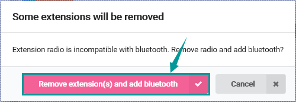

**3. Test Code：**

| Type     | Route                                                                                              | File Name                        |
|----------|----------------------------------------------------------------------------------------------------|----------------------------------|
| Hex file | ../Makecode Tutorial/Test Code/8.20：Bluetooth Multi-purpose Smart Car/8.20.1：Read Bluetooth Data | microbit-Read Bluetooth Data.hex |

Or you could edit code step by step in the editing area.

1.  Enter“Advanced” →“Serial” → “serial redirect to USB”

Place it into“on start”

\*\*\*\*\*\*\*\*\*\*\*\*\*\*\*\*\*\*\*\*\*\*\*\*\*\*\*\*\*\*\*\*\*\*\*\*\*\*\*\*\*\*\*\*\*\*\*\*\*\*\*\*\*\*\*\*\*\*\*\*\*\*\*\*\*\*\*\*\*\*\*\*\*\*\*\*\*

1.  Click“Bluetooth”→“on bluetooth connected”

Go to“Basic”to move“show icon”block into“on bluetooth connected” block.

\*\*\*\*\*\*\*\*\*\*\*\*\*\*\*\*\*\*\*\*\*\*\*\*\*\*\*\*\*\*\*\*\*\*\*\*\*\*\*\*\*\*\*\*\*\*\*\*\*\*\*\*\*\*\*\*\*\*\*\*\*\*\*\*\*\*\*\*\*\*\*\*\*\*\*\*\*

1.  Click“Variables”→“Make a Variable...”→“New variable name：”dialog box.

Input“connected”and click“OK”to create variable“connected”.

Drag“set connected to 0”under block “show icon” and change 0 into 1.

1.  Go to“Loops”to move block“while true do...”into“on bluetooth
    connected”block.

Enter“Logic”to drag out “=”block.

Click“Variables” to drag “connected” into left box of “=” block and change 0
into 1.

\*\*\*\*\*\*\*\*\*\*\*\*\*\*\*\*\*\*\*\*\*\*\*\*\*\*\*\*\*\*\*\*\*\*\*\*\*\*\*\*\*\*\*\*\*\*\*\*\*\*\*\*\*\*\*\*\*\*\*\*\*\*\*\*\*\*\*\*\*\*\*\*\*\*\*\*\*

1.  Then we generate variable“rec_data”in same way.

Then drag out“set rec_data to 0”and place it into block“while connected=1
do...”block.

Click“Bluetooth”→“more”→“bluetooth uart read until new line( )”

Keep it into 0 box and click triangle button to select \##.

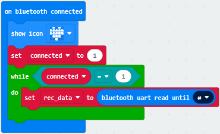

1.  Go to“Advanced”→“Serial”→“serial write string”

Move it below“set rec_data...until\##”block

And combine variable“rec_data”with“serial write string”block.

1.  Click“Advanced” →“Serial” →“serial write line” and edit code string as
    follows:

1.  Click“Bluetooth”to drag out“on bluetooth disconnected”.

1.  Go to“Bluetooth”→“on bluetooth disconnected”

Copy“show icon”block and keep it into block“on bluetooth disconnected”

Click triangle button to
select“”pattern.

Complete Program

| ”pattern.  |
|-------------------------------------------------------------------------------------------------------------------------------------------------------------------------------------------------------------------------------------------------------------------------------------------------------------------------------------------------------------------------------------------------------------------------------------------------------------------------------------------------------------------------------------|
|                                                                                                                                                                                                                                                                                                                                                                                                                                                                                                                                     |

Click“JavaScript" to view the corresponding JavaScript code:

1.  **Test Results：**

If you drag blocks step by step, you need to set as follows after finishing test
code.

Click

However, you could skip this step if you directly import test code.

After setting, download code to micro:bit board, don’t plug off USB cable([How
to download?](##A01) [How to quick download?](##_7.3.快速下载))

Next to download App.

For IOS system

a. Open App Store

b. Search keyes Bit Car and
click“”icon to download keyes Bit
Car

c. After the download, tap“OK”when a dialog box appears up.

d. Enable Bluetooth of cellphone or iPad.

Click“connect”button to search Bluetooth.

Then select“BCC micro:bit”to connect Bluetooth.

For Android system

Scan the QR code and enter website to download keyes_Bit_Car.apk

Then click“Always allow”and tap“install”

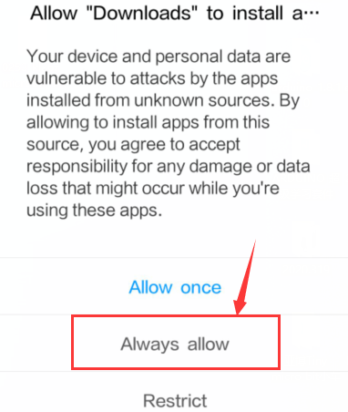

e. Tap“Open”or click“keyes Bit Car”icon to enter app.

A dialog box appears, then click“Allow”to turn on Bluetooth.

You also enable Bluetooth firstly.

Click“CONNECT”to search and link with Bluetooth.

Open CoolTerm, click Options to select SerialPort. Set COM port and 115200 baud
rate. Click“OK”and“Connect”.

Point at micro:bit board and press the icons on APP, the corresponding
characters are shown on CoolTerm monitor.

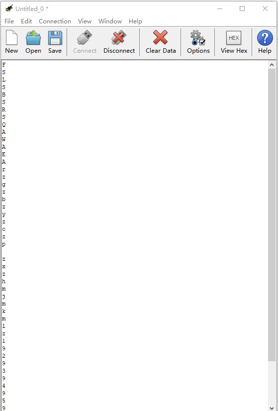

Through the test, we get the function of every icon, as shown below:

#### 20.2: Multi-purpose Smart Car

**1. Description：**

In this lesson, we will control the smart car to perform multipurpose function.

**2. Experimental Preparation：**

1.  Insert micro:bit board into slot of V2 shield.

2.  Place batteries into battery holder.

3.  Dial power switch to ON end

4.  Connect micro:bit to computer by USB cable and open online Makecode editor.

5.  Import Hex profile [**(How to import?)** ](##_7.6.导入代码), or click“New
    Project”and drag blocks step by step(add turtle-bit extension library first)

[**(How to add turtle-bit extension?)**](##M11)

As the Bluetooth and extension radio can’t work together, therefore, their
extension libraries are not compatible.

Therefore, remove extension(s) and add Bluetooth please if you see the following
prompt box pop up.

**3. Test Code：**

| Type     | Route                                                                                                   | File Name                             |
|----------|---------------------------------------------------------------------------------------------------------|---------------------------------------|
| Hex file | ../Makecode Tutorial/Test Code/8.20：Bluetooth Multi-purpose Smart Car /8.20.2：Multi-purpose Smart Car |  microbit-Multi-purpose Smart Car.hex |

Complete Code

Click“JavaScript" to switch into the corresponding JavaScript code:

**4. Test Results：**

We will control micro:bit smart car to move via app.

Enter Makecode online editor→Projecting
Settings→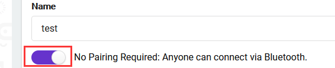, enable “No
Pairing....”(you could skip this step if you import test code directly)

Download code and turn on the switch at the back of micro:bit car. Then control
smart car via “keyes Bit Car”app

([How to download?](##A01) [How to quick download?](##_7.3.快速下载))

